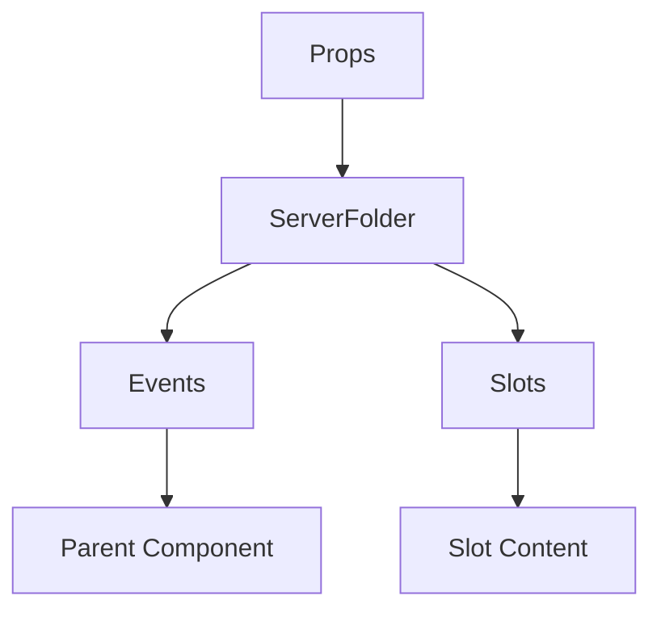

# ServerFolder

A Vue component.

**File:** `src/components/ServerFolder.vue`

## Overview



## Props

| Name | Type | Default | Required | Description |
|------|------|---------|----------|-------------|
| `folder` | `ServerFolder` | `undefined` | ✅ | No description |
| `servers` | `Array` | `undefined` | ✅ | No description |
| `selectedServerId` | `union` | `undefined` | ✅ | No description |

### Props Details

#### `folder`

No description available.

- **Type:** `ServerFolder`
- **Required:** Yes
- **Default:** `undefined`


#### `servers`

No description available.

- **Type:** `Array`
- **Required:** Yes
- **Default:** `undefined`


#### `selectedServerId`

No description available.

- **Type:** `union`
- **Required:** Yes
- **Default:** `undefined`


## Events

| Name | Parameters | Description |
|------|------------|-------------|
| `select-server` | `string` | No description |
| `open-context-menu` | `MouseEvent` | No description |
| `servers-reordered` | `Array` | No description |
| `server-dropped` | `string` | No description |
| `server-removed` | `string` | No description |
| `show-folder-tooltip` | `MouseEvent` | No description |
| `hide-folder-tooltip` | `unknown` | No description |

### Event Details

#### `select-server`

No description available.

**Parameters:** `string`


#### `open-context-menu`

No description available.

**Parameters:** `MouseEvent`


#### `servers-reordered`

No description available.

**Parameters:** `Array`


#### `server-dropped`

No description available.

**Parameters:** `string`


#### `server-removed`

No description available.

**Parameters:** `string`


#### `show-folder-tooltip`

No description available.

**Parameters:** `MouseEvent`


#### `hide-folder-tooltip`

No description available.

**Parameters:** `unknown`


## Slots

This component has no slots.

## Methods

This component exposes no public methods.

## Usage Example

```vue
<template>
  <ServerFolder
    :folder="undefined"
    :servers="[]"
    :selectedServerId="undefined"
    @select-server="handleSelectServer"
    @open-context-menu="handleOpenContextMenu"
    @servers-reordered="handleServersReordered"
    @server-dropped="handleServerDropped"
    @server-removed="handleServerRemoved"
    @show-folder-tooltip="handleShowFolderTooltip"
    @hide-folder-tooltip="handleHideFolderTooltip" />
</template>

<script setup lang="ts">
const handleSelectServer = (data: string) => {
  // Handle select-server event
}

const handleOpenContextMenu = (data: MouseEvent) => {
  // Handle open-context-menu event
}

const handleServersReordered = (data: Array) => {
  // Handle servers-reordered event
}

const handleServerDropped = (data: string) => {
  // Handle server-dropped event
}

const handleServerRemoved = (data: string) => {
  // Handle server-removed event
}

const handleShowFolderTooltip = (data: MouseEvent) => {
  // Handle show-folder-tooltip event
}

const handleHideFolderTooltip = (data: unknown) => {
  // Handle hide-folder-tooltip event
}
</script>
```


## File Location

`src/components/ServerFolder.vue`

---

*This documentation was automatically generated from the component source code.*