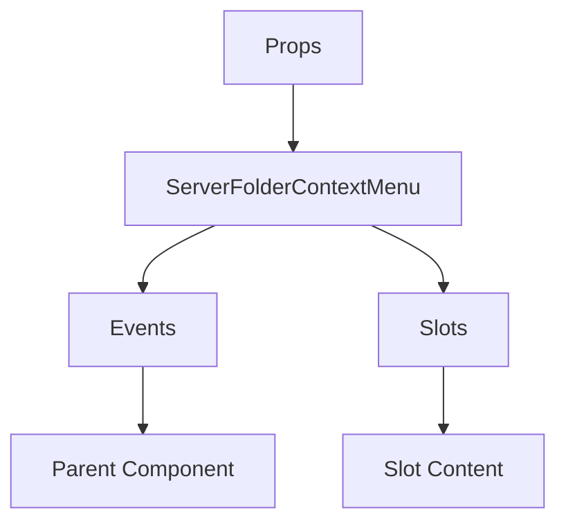

# ServerFolderContextMenu

A Vue component.

**File:** `src/components/ServerFolderContextMenu.vue`

## Overview



## Props

| Name | Type | Default | Required | Description |
|------|------|---------|----------|-------------|
| `isVisible` | `boolean` | `undefined` | ✅ | No description |
| `position` | `{ x: number; y: number }` | `undefined` | ✅ | No description |
| `folder` | `union` | `undefined` | ✅ | No description |
| `servers` | `Array` | `undefined` | ✅ | No description |

### Props Details

#### `isVisible`

No description available.

- **Type:** `boolean`
- **Required:** Yes
- **Default:** `undefined`


#### `position`

No description available.

- **Type:** `{ x: number; y: number }`
- **Required:** Yes
- **Default:** `undefined`


#### `folder`

No description available.

- **Type:** `union`
- **Required:** Yes
- **Default:** `undefined`


#### `servers`

No description available.

- **Type:** `Array`
- **Required:** Yes
- **Default:** `undefined`


## Events

| Name | Parameters | Description |
|------|------------|-------------|
| `close` | `unknown` | No description |
| `edit-folder` | `ServerFolder` | No description |
| `delete-folder` | `ServerFolder` | No description |
| `toggle-expanded` | `ServerFolder` | No description |
| `mark-as-read` | `ServerFolder` | No description |

### Event Details

#### `close`

No description available.

**Parameters:** `unknown`


#### `edit-folder`

No description available.

**Parameters:** `ServerFolder`


#### `delete-folder`

No description available.

**Parameters:** `ServerFolder`


#### `toggle-expanded`

No description available.

**Parameters:** `ServerFolder`


#### `mark-as-read`

No description available.

**Parameters:** `ServerFolder`


## Slots

This component has no slots.

## Methods

This component exposes no public methods.

## Usage Example

```vue
<template>
  <ServerFolderContextMenu
    :isVisible="true"
    :position="undefined"
    :folder="undefined"
    :servers="[]"
    @close="handleClose"
    @edit-folder="handleEditFolder"
    @delete-folder="handleDeleteFolder"
    @toggle-expanded="handleToggleExpanded"
    @mark-as-read="handleMarkAsRead" />
</template>

<script setup lang="ts">
const handleClose = (data: unknown) => {
  // Handle close event
}

const handleEditFolder = (data: ServerFolder) => {
  // Handle edit-folder event
}

const handleDeleteFolder = (data: ServerFolder) => {
  // Handle delete-folder event
}

const handleToggleExpanded = (data: ServerFolder) => {
  // Handle toggle-expanded event
}

const handleMarkAsRead = (data: ServerFolder) => {
  // Handle mark-as-read event
}
</script>
```


## File Location

`src/components/ServerFolderContextMenu.vue`

---

*This documentation was automatically generated from the component source code.*