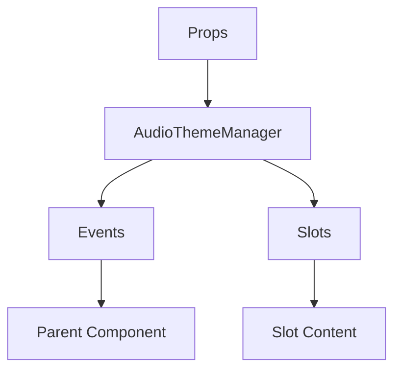

# AudioThemeManager

A Vue component.

**File:** `src/components/settings/AudioThemeManager.vue`

## Overview



## Props

| Name | Type | Default | Required | Description |
|------|------|---------|----------|-------------|
| `showTestButton` | `boolean` | `true` | ❌ | No description |
| `showVolumeControl` | `boolean` | `true` | ❌ | No description |
| `showStatus` | `boolean` | `true` | ❌ | No description |
| `showCacheButton` | `boolean` | `false` | ❌ | No description |
| `showAdvanced` | `boolean` | `false` | ❌ | No description |
| `compact` | `boolean` | `false` | ❌ | No description |
| `categorized` | `boolean` | `true` | ❌ | No description |

### Props Details

#### `showTestButton`

No description available.

- **Type:** `boolean`
- **Required:** No
- **Default:** `true`


#### `showVolumeControl`

No description available.

- **Type:** `boolean`
- **Required:** No
- **Default:** `true`


#### `showStatus`

No description available.

- **Type:** `boolean`
- **Required:** No
- **Default:** `true`


#### `showCacheButton`

No description available.

- **Type:** `boolean`
- **Required:** No
- **Default:** `false`


#### `showAdvanced`

No description available.

- **Type:** `boolean`
- **Required:** No
- **Default:** `false`


#### `compact`

No description available.

- **Type:** `boolean`
- **Required:** No
- **Default:** `false`


#### `categorized`

No description available.

- **Type:** `boolean`
- **Required:** No
- **Default:** `true`


## Events

| Name | Parameters | Description |
|------|------------|-------------|
| `themeChanged` | `string` | No description |
| `volumeChanged` | `number` | No description |
| `tested` | `string` | No description |

### Event Details

#### `themeChanged`

No description available.

**Parameters:** `string`


#### `volumeChanged`

No description available.

**Parameters:** `number`


#### `tested`

No description available.

**Parameters:** `string`


## Slots

This component has no slots.

## Methods

This component exposes no public methods.

## Usage Example

```vue
<template>
  <AudioThemeManager
    
    @themeChanged="handleThemeChanged"
    @volumeChanged="handleVolumeChanged"
    @tested="handleTested" />
</template>

<script setup lang="ts">
const handleThemeChanged = (data: string) => {
  // Handle themeChanged event
}

const handleVolumeChanged = (data: number) => {
  // Handle volumeChanged event
}

const handleTested = (data: string) => {
  // Handle tested event
}
</script>
```


## File Location

`src/components/settings/AudioThemeManager.vue`

---

*This documentation was automatically generated from the component source code.*