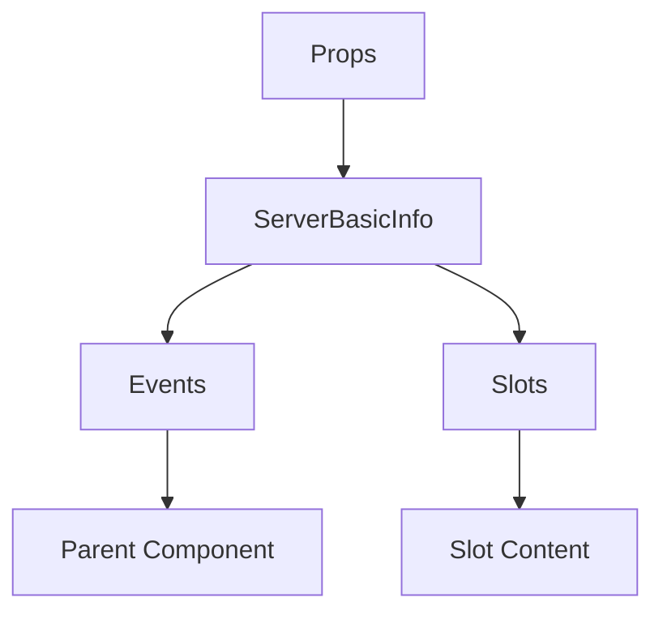

# ServerBasicInfo

A Vue component.

**File:** `src/components/settings/ServerBasicInfo.vue`

## Overview



## Props

| Name | Type | Default | Required | Description |
|------|------|---------|----------|-------------|
| `server` | `Server` | `undefined` | ✅ | No description |
| `selectedFile` | `union` | `undefined` | ✅ | No description |
| `ownerName` | `string` | `undefined` | ✅ | No description |
| `loading` | `boolean` | `undefined` | ✅ | No description |
| `permissions` | `ServerPermissions` | `undefined` | ✅ | No description |

### Props Details

#### `server`

No description available.

- **Type:** `Server`
- **Required:** Yes
- **Default:** `undefined`


#### `selectedFile`

No description available.

- **Type:** `union`
- **Required:** Yes
- **Default:** `undefined`


#### `ownerName`

No description available.

- **Type:** `string`
- **Required:** Yes
- **Default:** `undefined`


#### `loading`

No description available.

- **Type:** `boolean`
- **Required:** Yes
- **Default:** `undefined`


#### `permissions`

No description available.

- **Type:** `ServerPermissions`
- **Required:** Yes
- **Default:** `undefined`


## Events

| Name | Parameters | Description |
|------|------------|-------------|
| `update:server` | `Server` | No description |
| `update:selectedFile` | `union` | No description |
| `file-change` | `union` | No description |

### Event Details

#### `update:server`

No description available.

**Parameters:** `Server`


#### `update:selectedFile`

No description available.

**Parameters:** `union`


#### `file-change`

No description available.

**Parameters:** `union`


## Slots

This component has no slots.

## Methods

This component exposes no public methods.

## Usage Example

```vue
<template>
  <ServerBasicInfo
    :server="undefined"
    :selectedFile="undefined"
    :ownerName=""example""
    :loading="true"
    :permissions="undefined"
    @update:server="handleUpdate:server"
    @update:selectedFile="handleUpdate:selectedFile"
    @file-change="handleFileChange" />
</template>

<script setup lang="ts">
const handleUpdate:server = (data: Server) => {
  // Handle update:server event
}

const handleUpdate:selectedFile = (data: union) => {
  // Handle update:selectedFile event
}

const handleFileChange = (data: union) => {
  // Handle file-change event
}
</script>
```


## File Location

`src/components/settings/ServerBasicInfo.vue`

---

*This documentation was automatically generated from the component source code.*