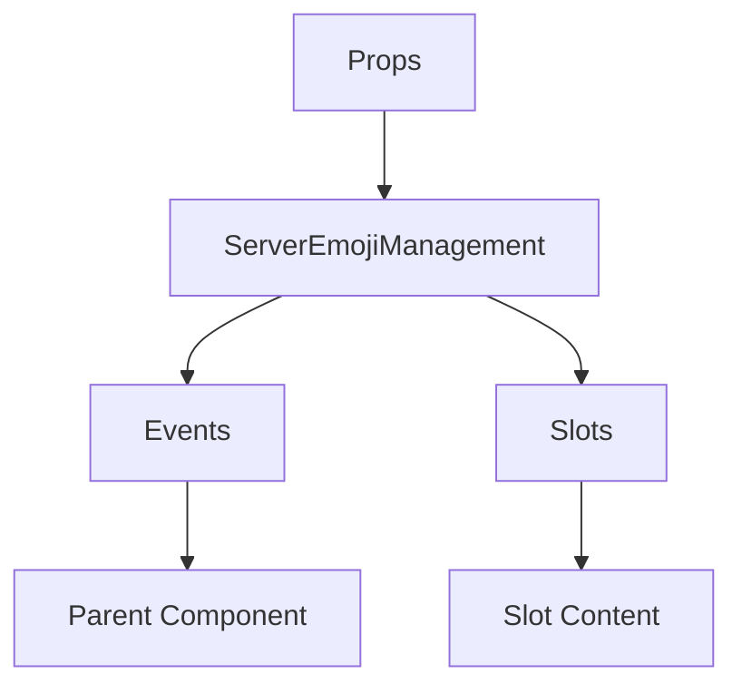

# ServerEmojiManagement

A Vue component.

**File:** `src/components/settings/ServerEmojiManagement.vue`

## Overview



## Props

| Name | Type | Default | Required | Description |
|------|------|---------|----------|-------------|
| `emojis` | `Array` | `undefined` | ✅ | No description |
| `allowCrossServer` | `boolean` | `undefined` | ✅ | No description |
| `serverId` | `string` | `undefined` | ✅ | No description |
| `ownerId` | `string` | `undefined` | ✅ | No description |
| `loading` | `boolean` | `undefined` | ✅ | No description |
| `permissions` | `EmojiPermissions` | `undefined` | ✅ | No description |

### Props Details

#### `emojis`

No description available.

- **Type:** `Array`
- **Required:** Yes
- **Default:** `undefined`


#### `allowCrossServer`

No description available.

- **Type:** `boolean`
- **Required:** Yes
- **Default:** `undefined`


#### `serverId`

No description available.

- **Type:** `string`
- **Required:** Yes
- **Default:** `undefined`


#### `ownerId`

No description available.

- **Type:** `string`
- **Required:** Yes
- **Default:** `undefined`


#### `loading`

No description available.

- **Type:** `boolean`
- **Required:** Yes
- **Default:** `undefined`


#### `permissions`

No description available.

- **Type:** `EmojiPermissions`
- **Required:** Yes
- **Default:** `undefined`


## Events

| Name | Parameters | Description |
|------|------------|-------------|
| `update:emojis` | `Array` | No description |
| `update:allowCrossServer` | `boolean` | No description |
| `emoji-uploaded` | `Emoji` | No description |
| `emoji-deleted` | `string` | No description |

### Event Details

#### `update:emojis`

No description available.

**Parameters:** `Array`


#### `update:allowCrossServer`

No description available.

**Parameters:** `boolean`


#### `emoji-uploaded`

No description available.

**Parameters:** `Emoji`


#### `emoji-deleted`

No description available.

**Parameters:** `string`


## Slots

This component has no slots.

## Methods

This component exposes no public methods.

## Usage Example

```vue
<template>
  <ServerEmojiManagement
    :emojis="[]"
    :allowCrossServer="true"
    :serverId=""example""
    :ownerId=""example""
    :loading="true"
    :permissions="undefined"
    @update:emojis="handleUpdate:emojis"
    @update:allowCrossServer="handleUpdate:allowCrossServer"
    @emoji-uploaded="handleEmojiUploaded"
    @emoji-deleted="handleEmojiDeleted" />
</template>

<script setup lang="ts">
const handleUpdate:emojis = (data: Array) => {
  // Handle update:emojis event
}

const handleUpdate:allowCrossServer = (data: boolean) => {
  // Handle update:allowCrossServer event
}

const handleEmojiUploaded = (data: Emoji) => {
  // Handle emoji-uploaded event
}

const handleEmojiDeleted = (data: string) => {
  // Handle emoji-deleted event
}
</script>
```


## File Location

`src/components/settings/ServerEmojiManagement.vue`

---

*This documentation was automatically generated from the component source code.*