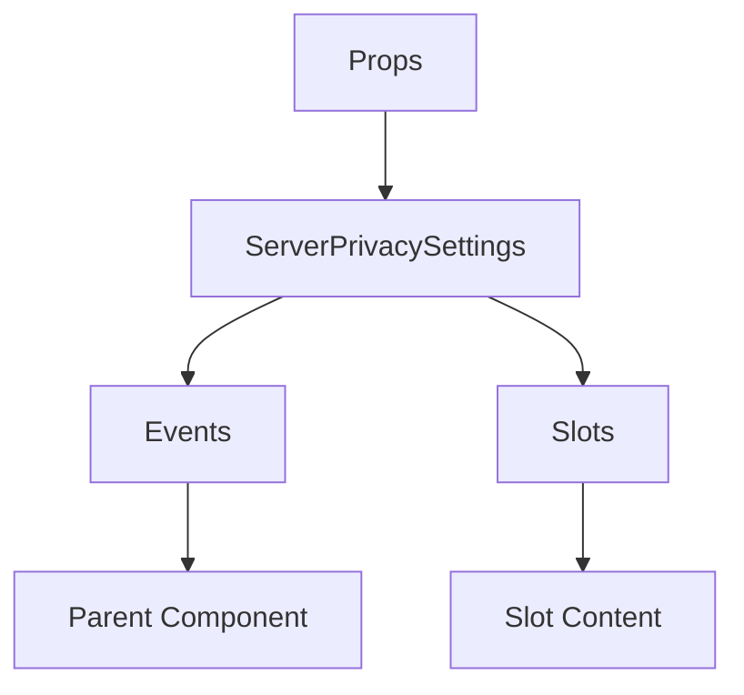

# ServerPrivacySettings

A Vue component.

**File:** `src/components/settings/ServerPrivacySettings.vue`

## Overview



## Props

| Name | Type | Default | Required | Description |
|------|------|---------|----------|-------------|
| `isPublic` | `boolean` | `undefined` | ✅ | No description |
| `federationEnabled` | `boolean` | `false` | ✅ | No description |
| `loading` | `boolean` | `undefined` | ✅ | No description |
| `permissions` | `ServerPermissions` | `undefined` | ✅ | No description |

### Props Details

#### `isPublic`

No description available.

- **Type:** `boolean`
- **Required:** Yes
- **Default:** `undefined`


#### `federationEnabled`

No description available.

- **Type:** `boolean`
- **Required:** Yes
- **Default:** `false`


#### `loading`

No description available.

- **Type:** `boolean`
- **Required:** Yes
- **Default:** `undefined`


#### `permissions`

No description available.

- **Type:** `ServerPermissions`
- **Required:** Yes
- **Default:** `undefined`


## Events

| Name | Parameters | Description |
|------|------------|-------------|
| `update:isPublic` | `boolean` | No description |
| `update:federationEnabled` | `boolean` | No description |

### Event Details

#### `update:isPublic`

No description available.

**Parameters:** `boolean`


#### `update:federationEnabled`

No description available.

**Parameters:** `boolean`


## Slots

This component has no slots.

## Methods

This component exposes no public methods.

## Usage Example

```vue
<template>
  <ServerPrivacySettings
    :isPublic="true"
    :federationEnabled="true"
    :loading="true"
    :permissions="undefined"
    @update:isPublic="handleUpdate:isPublic"
    @update:federationEnabled="handleUpdate:federationEnabled" />
</template>

<script setup lang="ts">
const handleUpdate:isPublic = (data: boolean) => {
  // Handle update:isPublic event
}

const handleUpdate:federationEnabled = (data: boolean) => {
  // Handle update:federationEnabled event
}
</script>
```


## File Location

`src/components/settings/ServerPrivacySettings.vue`

---

*This documentation was automatically generated from the component source code.*