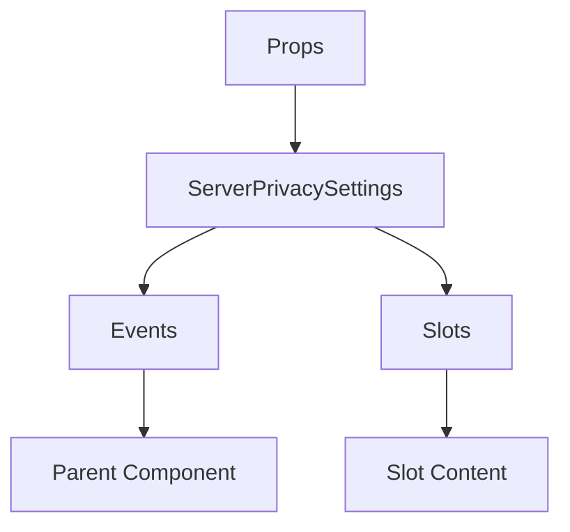

# ServerPrivacySettings

A Vue component.

**File:** `src/components/settings/ServerPrivacySettings.vue`

## Overview


```mermaid
graph TB
    PROPS[Props] --> COMPONENT[ServerPrivacySettings]
    COMPONENT --> EVENTS[Events]
    COMPONENT --> SLOTS[Slots]
    EVENTS --> PARENT[Parent Component]
    SLOTS --> CONTENT[Slot Content]
```

## Props

| Name | Type | Default | Required | Description |
|------|------|---------|----------|-------------|
| `isPublic` | `boolean` | `undefined` | ✅ | No description |
| `loading` | `boolean` | `undefined` | ✅ | No description |
| `permissions` | `ServerPermissions` | `undefined` | ✅ | No description |

### Props Details

#### `isPublic`

No description available.

- **Type:** `boolean`
- **Required:** Yes
- **Default:** `undefined`


#### `loading`

No description available.

- **Type:** `boolean`
- **Required:** Yes
- **Default:** `undefined`


#### `permissions`

No description available.

- **Type:** `ServerPermissions`
- **Required:** Yes
- **Default:** `undefined`


## Events

| Name | Parameters | Description |
|------|------------|-------------|
| `update:isPublic` | boolean | No description |

### Event Details

#### `update:isPublic`

No description available.

**Parameters:** `boolean`


## Slots

This component has no slots.

## Methods

This component exposes no public methods.

## Usage Example

```vue
<template>
  <ServerPrivacySettings
    :isPublic="true"
    :loading="true"
    :permissions="undefined"
    @update:isPublic="handleUpdate:isPublic" />
</template>

<script setup lang="ts">
const handleUpdate:isPublic = (boolean) => {
  // Handle update:isPublic event
}
</script>
```


## File Location

`src/components/settings/ServerPrivacySettings.vue`

---

*This documentation was automatically generated from the component source code.*