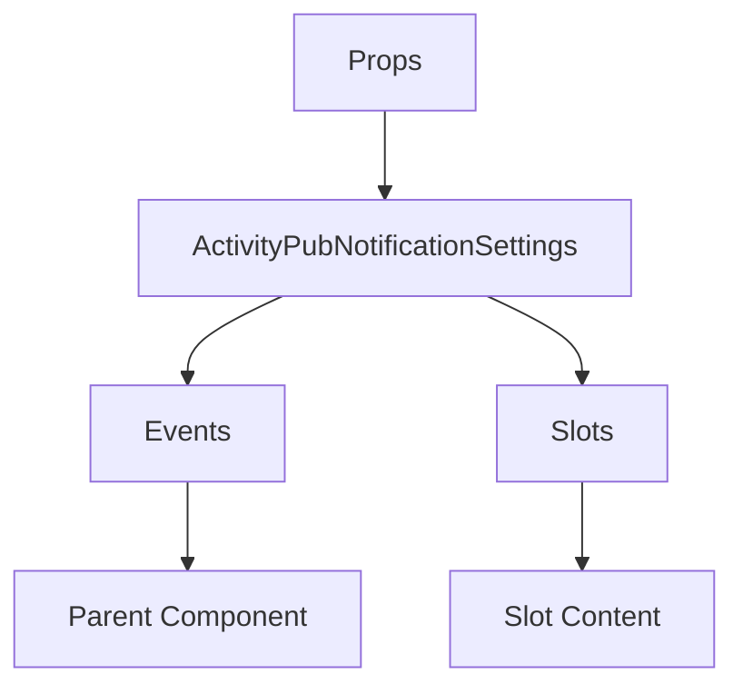

# ActivityPubNotificationSettings

No description available.

**File:** `src/components/settings/user/ActivityPubNotificationSettings.vue`

## Overview



## Props

| Name | Type | Default | Required | Description |
|------|------|---------|----------|-------------|
| `loading` | `boolean` | `false` | ❌ | No description |

### Props Details

#### `loading`

No description available.

- **Type:** `boolean`
- **Required:** No
- **Default:** `false`


## Events

| Name | Parameters | Description |
|------|------------|-------------|
| `update-preferences` | Partial | No description |

### Event Details

#### `update-preferences`

No description available.

**Parameters:** `Partial`


## Slots

This component has no slots.

## Methods

This component exposes no public methods.

## Usage Example

```vue
<template>
  <ActivityPubNotificationSettings
    
    @update-preferences="handleUpdate-preferences" />
</template>

<script setup lang="ts">
const handleUpdate-preferences = (Partial) => {
  // Handle update-preferences event
}
</script>
```


## File Location

`src/components/settings/user/ActivityPubNotificationSettings.vue`

---

*This documentation was automatically generated from the component source code.*