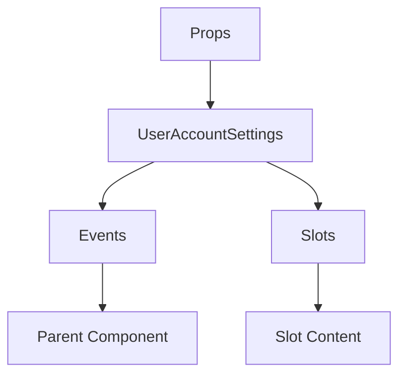

# UserAccountSettings

A Vue component.

**File:** `src/components/settings/user/UserAccountSettings.vue`

## Overview



## Props

| Name | Type | Default | Required | Description |
|------|------|---------|----------|-------------|
| `profile` | `union` | `undefined` | ✅ | No description |
| `loading` | `boolean` | `undefined` | ✅ | No description |

### Props Details

#### `profile`

No description available.

- **Type:** `union`
- **Required:** Yes
- **Default:** `undefined`


#### `loading`

No description available.

- **Type:** `boolean`
- **Required:** Yes
- **Default:** `undefined`


## Events

| Name | Parameters | Description |
|------|------------|-------------|
| `update-profile` | `Partial` | No description |
| `upload-avatar` | `File` | No description |
| `upload-banner` | `File` | No description |

### Event Details

#### `update-profile`

No description available.

**Parameters:** `Partial`


#### `upload-avatar`

No description available.

**Parameters:** `File`


#### `upload-banner`

No description available.

**Parameters:** `File`


## Slots

This component has no slots.

## Methods

This component exposes no public methods.

## Usage Example

```vue
<template>
  <UserAccountSettings
    :profile="undefined"
    :loading="true"
    @update-profile="handleUpdateProfile"
    @upload-avatar="handleUploadAvatar"
    @upload-banner="handleUploadBanner" />
</template>

<script setup lang="ts">
const handleUpdateProfile = (data: Partial) => {
  // Handle update-profile event
}

const handleUploadAvatar = (data: File) => {
  // Handle upload-avatar event
}

const handleUploadBanner = (data: File) => {
  // Handle upload-banner event
}
</script>
```


## File Location

`src/components/settings/user/UserAccountSettings.vue`

---

*This documentation was automatically generated from the component source code.*