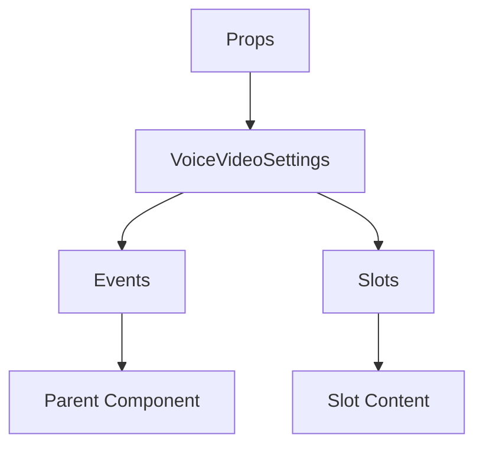

# VoiceVideoSettings

A Vue component.

**File:** `src/components/settings/user/VoiceVideoSettings.vue`

## Overview



## Props

| Name | Type | Default | Required | Description |
|------|------|---------|----------|-------------|
| `loading` | `boolean` | `undefined` | ✅ | No description |

### Props Details

#### `loading`

No description available.

- **Type:** `boolean`
- **Required:** Yes
- **Default:** `undefined`


## Events

| Name | Parameters | Description |
|------|------------|-------------|
| `update-voice-settings` | `any` | No description |

### Event Details

#### `update-voice-settings`

No description available.

**Parameters:** `any`


## Slots

This component has no slots.

## Methods

This component exposes no public methods.

## Usage Example

```vue
<template>
  <VoiceVideoSettings
    :loading="true"
    @update-voice-settings="handleUpdateVoiceSettings" />
</template>

<script setup lang="ts">
const handleUpdateVoiceSettings = (data: any) => {
  // Handle update-voice-settings event
}
</script>
```


## File Location

`src/components/settings/user/VoiceVideoSettings.vue`

---

*This documentation was automatically generated from the component source code.*