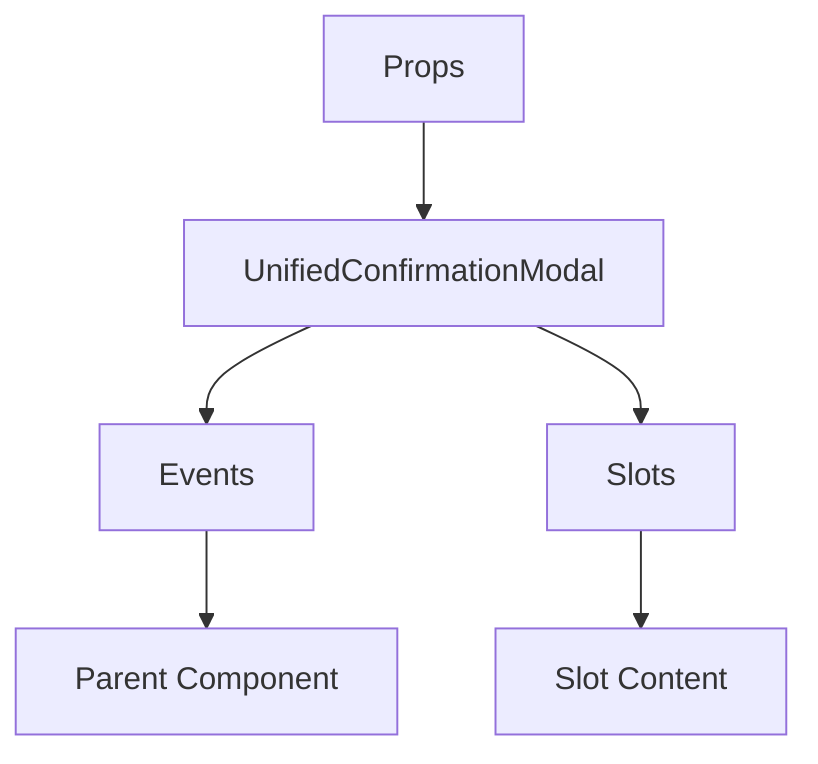

# UnifiedConfirmationModal

A Vue component.

**File:** `src/components/shared/UnifiedConfirmationModal.vue`

## Overview



## Props

| Name | Type | Default | Required | Description |
|------|------|---------|----------|-------------|
| `modelValue` | `boolean` | `undefined` | ✅ | No description |
| `title` | `string` | `undefined` | ✅ | No description |
| `message` | `string` | `undefined` | ✅ | No description |
| `secondaryMessage` | `string` | `undefined` | ❌ | No description |
| `confirmButtonText` | `string` | `'Confirm'` | ❌ | No description |
| `subtitle` | `string` | `undefined` | ❌ | No description |
| `requireConfirmation` | `boolean` | `false` | ❌ | No description |
| `confirmationText` | `string` | `'DELETE'` | ❌ | No description |
| `dangerAction` | `boolean` | `false` | ❌ | No description |

### Props Details

#### `modelValue`

No description available.

- **Type:** `boolean`
- **Required:** Yes
- **Default:** `undefined`


#### `title`

No description available.

- **Type:** `string`
- **Required:** Yes
- **Default:** `undefined`


#### `message`

No description available.

- **Type:** `string`
- **Required:** Yes
- **Default:** `undefined`


#### `secondaryMessage`

No description available.

- **Type:** `string`
- **Required:** No
- **Default:** `undefined`


#### `confirmButtonText`

No description available.

- **Type:** `string`
- **Required:** No
- **Default:** `'Confirm'`


#### `subtitle`

No description available.

- **Type:** `string`
- **Required:** No
- **Default:** `undefined`


#### `requireConfirmation`

No description available.

- **Type:** `boolean`
- **Required:** No
- **Default:** `false`


#### `confirmationText`

No description available.

- **Type:** `string`
- **Required:** No
- **Default:** `'DELETE'`


#### `dangerAction`

No description available.

- **Type:** `boolean`
- **Required:** No
- **Default:** `false`


## Events

| Name | Parameters | Description |
|------|------------|-------------|
| `update:modelValue` | `boolean` | No description |
| `confirm` | `unknown` | No description |
| `cancel` | `unknown` | No description |

### Event Details

#### `update:modelValue`

No description available.

**Parameters:** `boolean`


#### `confirm`

No description available.

**Parameters:** `unknown`


#### `cancel`

No description available.

**Parameters:** `unknown`


## Slots

This component has no slots.

## Methods

This component exposes no public methods.

## Usage Example

```vue
<template>
  <UnifiedConfirmationModal
    :modelValue="true"
    :title=""example""
    :message=""example""
    @update:modelValue="handleUpdate:modelValue"
    @confirm="handleConfirm"
    @cancel="handleCancel" />
</template>

<script setup lang="ts">
const handleUpdate:modelValue = (data: boolean) => {
  // Handle update:modelValue event
}

const handleConfirm = (data: unknown) => {
  // Handle confirm event
}

const handleCancel = (data: unknown) => {
  // Handle cancel event
}
</script>
```


## File Location

`src/components/shared/UnifiedConfirmationModal.vue`

---

*This documentation was automatically generated from the component source code.*