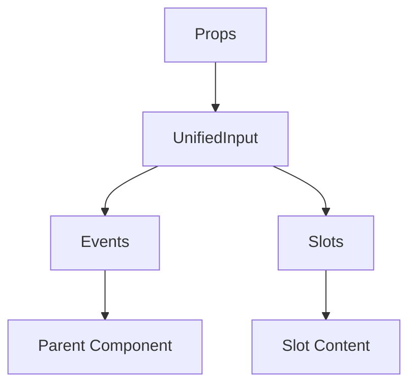

# UnifiedInput

A Vue component.

**File:** `src/components/shared/UnifiedInput.vue`

## Overview



## Props

| Name | Type | Default | Required | Description |
|------|------|---------|----------|-------------|
| `modelValue` | `union` | `undefined` | ✅ | No description |
| `type` | `string` | `'text'` | ❌ | No description |
| `placeholder` | `string` | `undefined` | ❌ | No description |
| `label` | `string` | `undefined` | ❌ | No description |
| `hint` | `string` | `undefined` | ❌ | No description |
| `errorMessage` | `string` | `undefined` | ❌ | No description |
| `disabled` | `boolean` | `undefined` | ❌ | No description |
| `readonly` | `boolean` | `undefined` | ❌ | No description |
| `required` | `boolean` | `undefined` | ❌ | No description |
| `autocomplete` | `string` | `undefined` | ❌ | No description |
| `maxLength` | `number` | `undefined` | ❌ | No description |
| `minLength` | `number` | `undefined` | ❌ | No description |
| `min` | `union` | `undefined` | ❌ | No description |
| `max` | `union` | `undefined` | ❌ | No description |
| `step` | `union` | `undefined` | ❌ | No description |
| `rows` | `number` | `undefined` | ❌ | No description |
| `cols` | `number` | `undefined` | ❌ | No description |
| `resize` | `boolean` | `undefined` | ❌ | No description |
| `size` | `union` | `'md'` | ❌ | No description |
| `variant` | `union` | `'default'` | ❌ | No description |
| `prefixIcon` | `any` | `undefined` | ❌ | No description |
| `suffixIcon` | `any` | `undefined` | ❌ | No description |
| `clearable` | `boolean` | `undefined` | ❌ | No description |
| `clearButtonLabel` | `string` | `'Clear input'` | ❌ | No description |
| `showCharCount` | `boolean` | `undefined` | ❌ | No description |
| `passwordToggle` | `boolean` | `undefined` | ❌ | No description |
| `id` | `string` | `undefined` | ❌ | No description |

### Props Details

#### `modelValue`

No description available.

- **Type:** `union`
- **Required:** Yes
- **Default:** `undefined`


#### `type`

No description available.

- **Type:** `string`
- **Required:** No
- **Default:** `'text'`


#### `placeholder`

No description available.

- **Type:** `string`
- **Required:** No
- **Default:** `undefined`


#### `label`

No description available.

- **Type:** `string`
- **Required:** No
- **Default:** `undefined`


#### `hint`

No description available.

- **Type:** `string`
- **Required:** No
- **Default:** `undefined`


#### `errorMessage`

No description available.

- **Type:** `string`
- **Required:** No
- **Default:** `undefined`


#### `disabled`

No description available.

- **Type:** `boolean`
- **Required:** No
- **Default:** `undefined`


#### `readonly`

No description available.

- **Type:** `boolean`
- **Required:** No
- **Default:** `undefined`


#### `required`

No description available.

- **Type:** `boolean`
- **Required:** No
- **Default:** `undefined`


#### `autocomplete`

No description available.

- **Type:** `string`
- **Required:** No
- **Default:** `undefined`


#### `maxLength`

No description available.

- **Type:** `number`
- **Required:** No
- **Default:** `undefined`


#### `minLength`

No description available.

- **Type:** `number`
- **Required:** No
- **Default:** `undefined`


#### `min`

No description available.

- **Type:** `union`
- **Required:** No
- **Default:** `undefined`


#### `max`

No description available.

- **Type:** `union`
- **Required:** No
- **Default:** `undefined`


#### `step`

No description available.

- **Type:** `union`
- **Required:** No
- **Default:** `undefined`


#### `rows`

No description available.

- **Type:** `number`
- **Required:** No
- **Default:** `undefined`


#### `cols`

No description available.

- **Type:** `number`
- **Required:** No
- **Default:** `undefined`


#### `resize`

No description available.

- **Type:** `boolean`
- **Required:** No
- **Default:** `undefined`


#### `size`

No description available.

- **Type:** `union`
- **Required:** No
- **Default:** `'md'`


#### `variant`

No description available.

- **Type:** `union`
- **Required:** No
- **Default:** `'default'`


#### `prefixIcon`

No description available.

- **Type:** `any`
- **Required:** No
- **Default:** `undefined`


#### `suffixIcon`

No description available.

- **Type:** `any`
- **Required:** No
- **Default:** `undefined`


#### `clearable`

No description available.

- **Type:** `boolean`
- **Required:** No
- **Default:** `undefined`


#### `clearButtonLabel`

No description available.

- **Type:** `string`
- **Required:** No
- **Default:** `'Clear input'`


#### `showCharCount`

No description available.

- **Type:** `boolean`
- **Required:** No
- **Default:** `undefined`


#### `passwordToggle`

No description available.

- **Type:** `boolean`
- **Required:** No
- **Default:** `undefined`


#### `id`

No description available.

- **Type:** `string`
- **Required:** No
- **Default:** `undefined`


## Events

| Name | Parameters | Description |
|------|------------|-------------|
| `update:modelValue` | `union` | No description |
| `input` | `Event` | No description |
| `change` | `Event` | No description |
| `blur` | `FocusEvent` | No description |
| `focus` | `FocusEvent` | No description |
| `keydown` | `KeyboardEvent` | No description |
| `keypress` | `KeyboardEvent` | No description |
| `keyup` | `KeyboardEvent` | No description |
| `clear` | `unknown` | No description |

### Event Details

#### `update:modelValue`

No description available.

**Parameters:** `union`


#### `input`

No description available.

**Parameters:** `Event`


#### `change`

No description available.

**Parameters:** `Event`


#### `blur`

No description available.

**Parameters:** `FocusEvent`


#### `focus`

No description available.

**Parameters:** `FocusEvent`


#### `keydown`

No description available.

**Parameters:** `KeyboardEvent`


#### `keypress`

No description available.

**Parameters:** `KeyboardEvent`


#### `keyup`

No description available.

**Parameters:** `KeyboardEvent`


#### `clear`

No description available.

**Parameters:** `unknown`


## Slots

| Name | Scoped | Description |
|------|--------|-------------|
| `prefix` | ❌ | No description |
| `suffix` | ❌ | No description |

### Slot Details

#### `prefix`

No description available.

**Scoped:** No


#### `suffix`

No description available.

**Scoped:** No


## Methods

This component exposes no public methods.

## Usage Example

```vue
<template>
  <UnifiedInput
    :modelValue="undefined"
    @update:modelValue="handleUpdate:modelValue"
    @input="handleInput"
    @change="handleChange"
    @blur="handleBlur"
    @focus="handleFocus"
    @keydown="handleKeydown"
    @keypress="handleKeypress"
    @keyup="handleKeyup"
    @clear="handleClear">
    <template #prefix>
      <!-- Slot content for prefix -->
    </template>
    <template #suffix>
      <!-- Slot content for suffix -->
    </template>
  </UnifiedInput>
</template>

<script setup lang="ts">
const handleUpdate:modelValue = (data: union) => {
  // Handle update:modelValue event
}

const handleInput = (data: Event) => {
  // Handle input event
}

const handleChange = (data: Event) => {
  // Handle change event
}

const handleBlur = (data: FocusEvent) => {
  // Handle blur event
}

const handleFocus = (data: FocusEvent) => {
  // Handle focus event
}

const handleKeydown = (data: KeyboardEvent) => {
  // Handle keydown event
}

const handleKeypress = (data: KeyboardEvent) => {
  // Handle keypress event
}

const handleKeyup = (data: KeyboardEvent) => {
  // Handle keyup event
}

const handleClear = (data: unknown) => {
  // Handle clear event
}
</script>
```


## File Location

`src/components/shared/UnifiedInput.vue`

---

*This documentation was automatically generated from the component source code.*