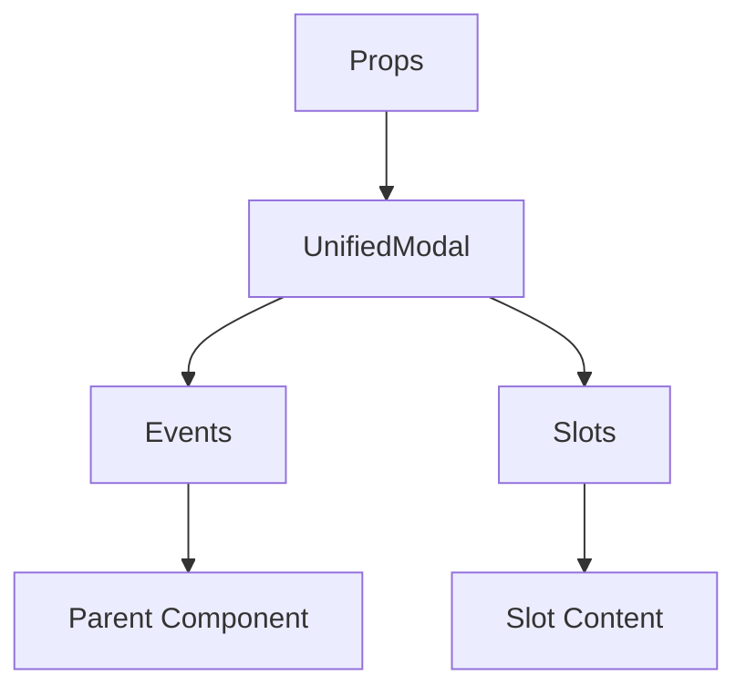

# UnifiedModal

A Vue component.

**File:** `src/components/shared/UnifiedModal.vue`

## Overview



## Props

| Name | Type | Default | Required | Description |
|------|------|---------|----------|-------------|
| `modelValue` | `boolean` | `undefined` | ✅ | No description |
| `title` | `string` | `undefined` | ❌ | No description |
| `subtitle` | `string` | `undefined` | ❌ | No description |
| `icon` | `any` | `undefined` | ❌ | No description |
| `size` | `union` | `'md'` | ❌ | No description |
| `fullHeight` | `boolean` | `undefined` | ❌ | No description |
| `hideHeader` | `boolean` | `undefined` | ❌ | No description |
| `showCloseButton` | `boolean` | `true` | ❌ | No description |
| `closeOnOverlay` | `boolean` | `true` | ❌ | No description |
| `closeOnEscape` | `boolean` | `true` | ❌ | No description |
| `persistent` | `boolean` | `false` | ❌ | No description |
| `containerClass` | `string` | `undefined` | ❌ | No description |
| `actions` | `Array` | `undefined` | ❌ | No description |
| `closeButtonLabel` | `string` | `'Close modal'` | ❌ | No description |
| `isProfile` | `boolean` | `undefined` | ❌ | No description |
| `noPadding` | `boolean` | `undefined` | ❌ | No description |

### Props Details

#### `modelValue`

No description available.

- **Type:** `boolean`
- **Required:** Yes
- **Default:** `undefined`


#### `title`

No description available.

- **Type:** `string`
- **Required:** No
- **Default:** `undefined`


#### `subtitle`

No description available.

- **Type:** `string`
- **Required:** No
- **Default:** `undefined`


#### `icon`

No description available.

- **Type:** `any`
- **Required:** No
- **Default:** `undefined`


#### `size`

No description available.

- **Type:** `union`
- **Required:** No
- **Default:** `'md'`


#### `fullHeight`

No description available.

- **Type:** `boolean`
- **Required:** No
- **Default:** `undefined`


#### `hideHeader`

No description available.

- **Type:** `boolean`
- **Required:** No
- **Default:** `undefined`


#### `showCloseButton`

No description available.

- **Type:** `boolean`
- **Required:** No
- **Default:** `true`


#### `closeOnOverlay`

No description available.

- **Type:** `boolean`
- **Required:** No
- **Default:** `true`


#### `closeOnEscape`

No description available.

- **Type:** `boolean`
- **Required:** No
- **Default:** `true`


#### `persistent`

No description available.

- **Type:** `boolean`
- **Required:** No
- **Default:** `false`


#### `containerClass`

No description available.

- **Type:** `string`
- **Required:** No
- **Default:** `undefined`


#### `actions`

No description available.

- **Type:** `Array`
- **Required:** No
- **Default:** `undefined`


#### `closeButtonLabel`

No description available.

- **Type:** `string`
- **Required:** No
- **Default:** `'Close modal'`


#### `isProfile`

No description available.

- **Type:** `boolean`
- **Required:** No
- **Default:** `undefined`


#### `noPadding`

No description available.

- **Type:** `boolean`
- **Required:** No
- **Default:** `undefined`


## Events

| Name | Parameters | Description |
|------|------------|-------------|
| `update:modelValue` | `boolean` | No description |
| `close` | `unknown` | No description |
| `open` | `unknown` | No description |
| `action` | `ModalAction` | No description |

### Event Details

#### `update:modelValue`

No description available.

**Parameters:** `boolean`


#### `close`

No description available.

**Parameters:** `unknown`


#### `open`

No description available.

**Parameters:** `unknown`


#### `action`

No description available.

**Parameters:** `ModalAction`


## Slots

| Name | Scoped | Description |
|------|--------|-------------|
| `customHeader` | ❌ | No description |
| `icon` | ❌ | No description |
| `header-content` | ❌ | No description |
| `default` | ❌ | No description |
| `footer` | ❌ | No description |

### Slot Details

#### `customHeader`

No description available.

**Scoped:** No


#### `icon`

No description available.

**Scoped:** No


#### `header-content`

No description available.

**Scoped:** No


#### `default`

No description available.

**Scoped:** No


#### `footer`

No description available.

**Scoped:** No


## Methods

This component exposes no public methods.

## Usage Example

```vue
<template>
  <UnifiedModal
    :modelValue="true"
    @update:modelValue="handleUpdate:modelValue"
    @close="handleClose"
    @open="handleOpen"
    @action="handleAction">
    <template #customHeader>
      <!-- Slot content for customHeader -->
    </template>
    <template #icon>
      <!-- Slot content for icon -->
    </template>
    <template #header-content>
      <!-- Slot content for header-content -->
    </template>
    <template #default>
      <!-- Slot content for default -->
    </template>
    <template #footer>
      <!-- Slot content for footer -->
    </template>
  </UnifiedModal>
</template>

<script setup lang="ts">
const handleUpdate:modelValue = (data: boolean) => {
  // Handle update:modelValue event
}

const handleClose = (data: unknown) => {
  // Handle close event
}

const handleOpen = (data: unknown) => {
  // Handle open event
}

const handleAction = (data: ModalAction) => {
  // Handle action event
}
</script>
```


## File Location

`src/components/shared/UnifiedModal.vue`

---

*This documentation was automatically generated from the component source code.*