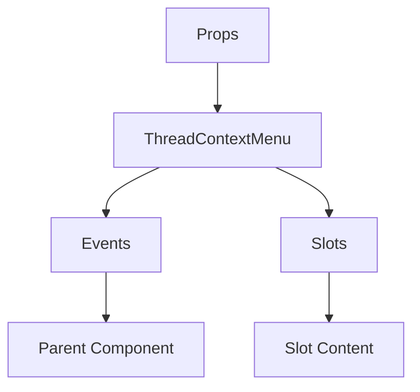

# ThreadContextMenu

A Vue component.

**File:** `src/components/threads/ThreadContextMenu.vue`

## Overview



## Props

| Name | Type | Default | Required | Description |
|------|------|---------|----------|-------------|
| `isVisible` | `boolean` | `undefined` | ✅ | No description |
| `position` | `{ x: number; y: number }` | `undefined` | ✅ | No description |
| `thread` | `union` | `undefined` | ✅ | No description |
| `serverId` | `string` | `undefined` | ❌ | No description |

### Props Details

#### `isVisible`

No description available.

- **Type:** `boolean`
- **Required:** Yes
- **Default:** `undefined`


#### `position`

No description available.

- **Type:** `{ x: number; y: number }`
- **Required:** Yes
- **Default:** `undefined`


#### `thread`

No description available.

- **Type:** `union`
- **Required:** Yes
- **Default:** `undefined`


#### `serverId`

No description available.

- **Type:** `string`
- **Required:** No
- **Default:** `undefined`


## Events

| Name | Parameters | Description |
|------|------------|-------------|
| `close` | `unknown` | No description |
| `leave` | `unknown` | No description |
| `edit` | `ThreadWithDetails` | No description |
| `open-split-view` | `ThreadWithDetails` | No description |
| `close-thread` | `ThreadWithDetails` | No description |
| `reopen` | `ThreadWithDetails` | No description |
| `lock` | `ThreadWithDetails` | No description |
| `unlock` | `ThreadWithDetails` | No description |
| `delete` | `ThreadWithDetails` | No description |

### Event Details

#### `close`

No description available.

**Parameters:** `unknown`


#### `leave`

No description available.

**Parameters:** `unknown`


#### `edit`

No description available.

**Parameters:** `ThreadWithDetails`


#### `open-split-view`

No description available.

**Parameters:** `ThreadWithDetails`


#### `close-thread`

No description available.

**Parameters:** `ThreadWithDetails`


#### `reopen`

No description available.

**Parameters:** `ThreadWithDetails`


#### `lock`

No description available.

**Parameters:** `ThreadWithDetails`


#### `unlock`

No description available.

**Parameters:** `ThreadWithDetails`


#### `delete`

No description available.

**Parameters:** `ThreadWithDetails`


## Slots

This component has no slots.

## Methods

This component exposes no public methods.

## Usage Example

```vue
<template>
  <ThreadContextMenu
    :isVisible="true"
    :position="undefined"
    :thread="undefined"
    @close="handleClose"
    @leave="handleLeave"
    @edit="handleEdit"
    @open-split-view="handleOpenSplitView"
    @close-thread="handleCloseThread"
    @reopen="handleReopen"
    @lock="handleLock"
    @unlock="handleUnlock"
    @delete="handleDelete" />
</template>

<script setup lang="ts">
const handleClose = (data: unknown) => {
  // Handle close event
}

const handleLeave = (data: unknown) => {
  // Handle leave event
}

const handleEdit = (data: ThreadWithDetails) => {
  // Handle edit event
}

const handleOpenSplitView = (data: ThreadWithDetails) => {
  // Handle open-split-view event
}

const handleCloseThread = (data: ThreadWithDetails) => {
  // Handle close-thread event
}

const handleReopen = (data: ThreadWithDetails) => {
  // Handle reopen event
}

const handleLock = (data: ThreadWithDetails) => {
  // Handle lock event
}

const handleUnlock = (data: ThreadWithDetails) => {
  // Handle unlock event
}

const handleDelete = (data: ThreadWithDetails) => {
  // Handle delete event
}
</script>
```


## File Location

`src/components/threads/ThreadContextMenu.vue`

---

*This documentation was automatically generated from the component source code.*