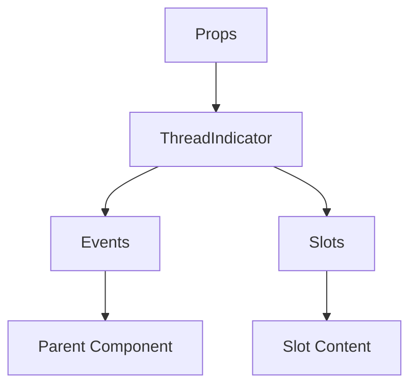

# ThreadIndicator

A Vue component.

**File:** `src/components/threads/ThreadIndicator.vue`

## Overview



## Props

| Name | Type | Default | Required | Description |
|------|------|---------|----------|-------------|
| `thread` | `union` | `undefined` | ❌ | No description |

### Props Details

#### `thread`

No description available.

- **Type:** `union`
- **Required:** No
- **Default:** `undefined`


## Events

| Name | Parameters | Description |
|------|------------|-------------|
| `open` | `ThreadData` | No description |

### Event Details

#### `open`

No description available.

**Parameters:** `ThreadData`


## Slots

This component has no slots.

## Methods

This component exposes no public methods.

## Usage Example

```vue
<template>
  <ThreadIndicator
    
    @open="handleOpen" />
</template>

<script setup lang="ts">
const handleOpen = (data: ThreadData) => {
  // Handle open event
}
</script>
```


## File Location

`src/components/threads/ThreadIndicator.vue`

---

*This documentation was automatically generated from the component source code.*