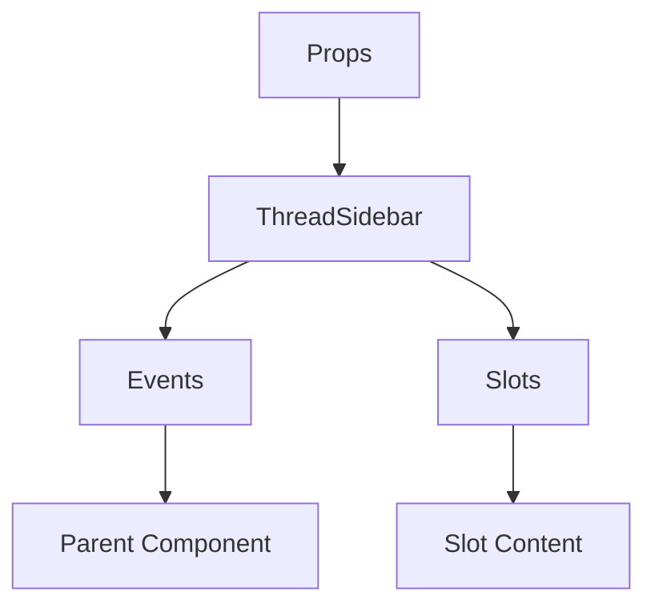

# ThreadSidebar

A Vue component.

**File:** `src/components/threads/ThreadSidebar.vue`

## Overview



## Props

| Name | Type | Default | Required | Description |
|------|------|---------|----------|-------------|
| `channelId` | `string` | `undefined` | ❌ | No description |
| `activeThreadId` | `string` | `undefined` | ❌ | No description |

### Props Details

#### `channelId`

No description available.

- **Type:** `string`
- **Required:** No
- **Default:** `undefined`


#### `activeThreadId`

No description available.

- **Type:** `string`
- **Required:** No
- **Default:** `undefined`


## Events

| Name | Parameters | Description |
|------|------------|-------------|
| `select-thread` | `ThreadWithDetails` | No description |

### Event Details

#### `select-thread`

No description available.

**Parameters:** `ThreadWithDetails`


## Slots

This component has no slots.

## Methods

This component exposes no public methods.

## Usage Example

```vue
<template>
  <ThreadSidebar
    
    @select-thread="handleSelectThread" />
</template>

<script setup lang="ts">
const handleSelectThread = (data: ThreadWithDetails) => {
  // Handle select-thread event
}
</script>
```


## File Location

`src/components/threads/ThreadSidebar.vue`

---

*This documentation was automatically generated from the component source code.*