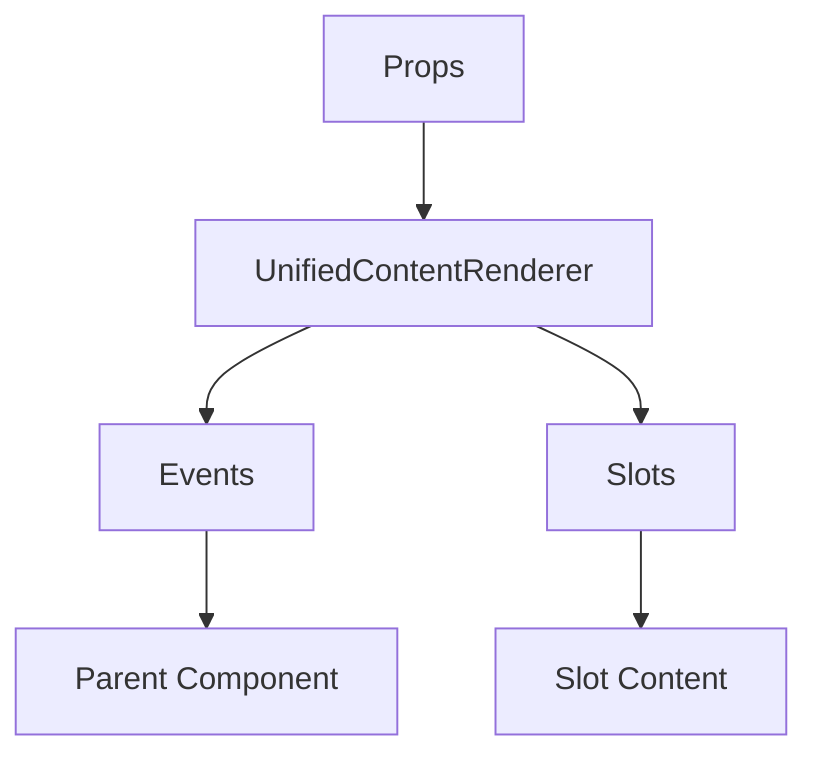

# UnifiedContentRenderer

A Vue component.

**File:** `src/components/UnifiedContentRenderer.vue`

## Overview



## Props

| Name | Type | Default | Required | Description |
|------|------|---------|----------|-------------|
| `content` | `union` | `undefined` | ✅ | No description |
| `mode` | `union` | `'display'` | ❌ | No description |
| `renderMode` | `union` | `'components'` | ❌ | No description |
| `showImages` | `boolean` | `true` | ❌ | No description |
| `showVideos` | `boolean` | `true` | ❌ | No description |
| `maxPreviewLength` | `number` | `500` | ❌ | No description |
| `singleLine` | `boolean` | `false` | ❌ | No description |
| `enableMarkdown` | `boolean` | `true` | ❌ | No description |
| `selectable` | `boolean` | `true` | ❌ | No description |
| `imageLoaded` | `Record` | `() => ({})` | ❌ | No description |
| `encrypted` | `boolean` | `false` | ❌ | No description |

### Props Details

#### `content`

No description available.

- **Type:** `union`
- **Required:** Yes
- **Default:** `undefined`


#### `mode`

No description available.

- **Type:** `union`
- **Required:** No
- **Default:** `'display'`


#### `renderMode`

No description available.

- **Type:** `union`
- **Required:** No
- **Default:** `'components'`


#### `showImages`

No description available.

- **Type:** `boolean`
- **Required:** No
- **Default:** `true`


#### `showVideos`

No description available.

- **Type:** `boolean`
- **Required:** No
- **Default:** `true`


#### `maxPreviewLength`

No description available.

- **Type:** `number`
- **Required:** No
- **Default:** `500`


#### `singleLine`

No description available.

- **Type:** `boolean`
- **Required:** No
- **Default:** `false`


#### `enableMarkdown`

No description available.

- **Type:** `boolean`
- **Required:** No
- **Default:** `true`


#### `selectable`

No description available.

- **Type:** `boolean`
- **Required:** No
- **Default:** `true`


#### `imageLoaded`

No description available.

- **Type:** `Record`
- **Required:** No
- **Default:** `() => ({})`


#### `encrypted`

No description available.

- **Type:** `boolean`
- **Required:** No
- **Default:** `false`


## Events

| Name | Parameters | Description |
|------|------------|-------------|
| `user-mention-click` | `string` | No description |
| `hashtag-click` | `string` | No description |
| `link-click` | `string` | No description |
| `image-load` | `string` | No description |
| `image-click` | `string` | No description |

### Event Details

#### `user-mention-click`

No description available.

**Parameters:** `string`


#### `hashtag-click`

No description available.

**Parameters:** `string`


#### `link-click`

No description available.

**Parameters:** `string`


#### `image-load`

No description available.

**Parameters:** `string`


#### `image-click`

No description available.

**Parameters:** `string`


## Slots

This component has no slots.

## Methods

This component exposes no public methods.

## Usage Example

```vue
<template>
  <UnifiedContentRenderer
    :content="undefined"
    @user-mention-click="handleUserMentionClick"
    @hashtag-click="handleHashtagClick"
    @link-click="handleLinkClick"
    @image-load="handleImageLoad"
    @image-click="handleImageClick" />
</template>

<script setup lang="ts">
const handleUserMentionClick = (data: string) => {
  // Handle user-mention-click event
}

const handleHashtagClick = (data: string) => {
  // Handle hashtag-click event
}

const handleLinkClick = (data: string) => {
  // Handle link-click event
}

const handleImageLoad = (data: string) => {
  // Handle image-load event
}

const handleImageClick = (data: string) => {
  // Handle image-click event
}
</script>
```


## File Location

`src/components/UnifiedContentRenderer.vue`

---

*This documentation was automatically generated from the component source code.*