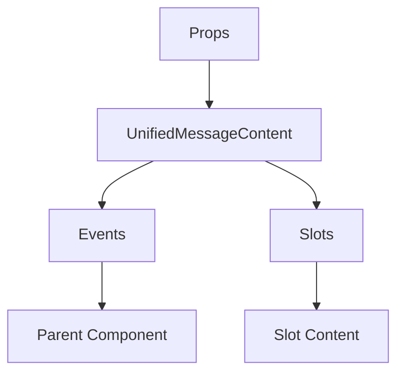

# UnifiedMessageContent

No description available.

**File:** `src/components/UnifiedMessageContent.vue`

## Overview


```mermaid
graph TB
    PROPS[Props] --> COMPONENT[UnifiedMessageContent]
    COMPONENT --> EVENTS[Events]
    COMPONENT --> SLOTS[Slots]
    EVENTS --> PARENT[Parent Component]
    SLOTS --> CONTENT[Slot Content]
```

## Props

| Name | Type | Default | Required | Description |
|------|------|---------|----------|-------------|
| `content` | `MessagePart[]` | `undefined` | ✅ | No description |
| `editableMessageId` | `string | null` | `null` | ❌ | No description |
| `messageId` | `string` | `undefined` | ✅ | No description |
| `imageLoaded` | `Record<string, boolean>` | `() => ({})` | ❌ | No description |
| `isSingleEmoji` | `boolean` | `false` | ❌ | No description |
| `editableContent` | `string` | `''` | ❌ | No description |
| `isSystem` | `boolean` | `false` | ❌ | No description |

### Props Details

#### `content`

No description available.

- **Type:** `MessagePart[]`
- **Required:** Yes
- **Default:** `undefined`


#### `editableMessageId`

No description available.

- **Type:** `string | null`
- **Required:** No
- **Default:** `null`


#### `messageId`

No description available.

- **Type:** `string`
- **Required:** Yes
- **Default:** `undefined`


#### `imageLoaded`

No description available.

- **Type:** `Record<string, boolean>`
- **Required:** No
- **Default:** `() => ({})`


#### `isSingleEmoji`

No description available.

- **Type:** `boolean`
- **Required:** No
- **Default:** `false`


#### `editableContent`

No description available.

- **Type:** `string`
- **Required:** No
- **Default:** `''`


#### `isSystem`

No description available.

- **Type:** `boolean`
- **Required:** No
- **Default:** `false`


## Events

| Name | Parameters | Description |
|------|------------|-------------|
| `show-user-profile` | unknown | No description |
| `image-loaded` | unknown | No description |
| `open-lightbox` | unknown | No description |
| `update:message` | unknown | No description |
| `update:content` | unknown | No description |
| `cancel-edit` | unknown | No description |

### Event Details

#### `show-user-profile`

No description available.

**Parameters:** `unknown`


#### `image-loaded`

No description available.

**Parameters:** `unknown`


#### `open-lightbox`

No description available.

**Parameters:** `unknown`


#### `update:message`

No description available.

**Parameters:** `unknown`


#### `update:content`

No description available.

**Parameters:** `unknown`


#### `cancel-edit`

No description available.

**Parameters:** `unknown`


## Slots

This component has no slots.

## Methods

This component exposes no public methods.

## Usage Example

```vue
<template>
  <UnifiedMessageContent
    :content="undefined"
    :messageId=""example""
    @show-user-profile="handleShow-user-profile"
    @image-loaded="handleImage-loaded"
    @open-lightbox="handleOpen-lightbox"
    @update:message="handleUpdate:message"
    @update:content="handleUpdate:content"
    @cancel-edit="handleCancel-edit" />
</template>

<script setup lang="ts">
const handleShow-user-profile = (data) => {
  // Handle show-user-profile event
}

const handleImage-loaded = (data) => {
  // Handle image-loaded event
}

const handleOpen-lightbox = (data) => {
  // Handle open-lightbox event
}

const handleUpdate:message = (data) => {
  // Handle update:message event
}

const handleUpdate:content = (data) => {
  // Handle update:content event
}

const handleCancel-edit = (data) => {
  // Handle cancel-edit event
}
</script>
```


## File Location

`src/components/UnifiedMessageContent.vue`

---

*This documentation was automatically generated from the component source code.*