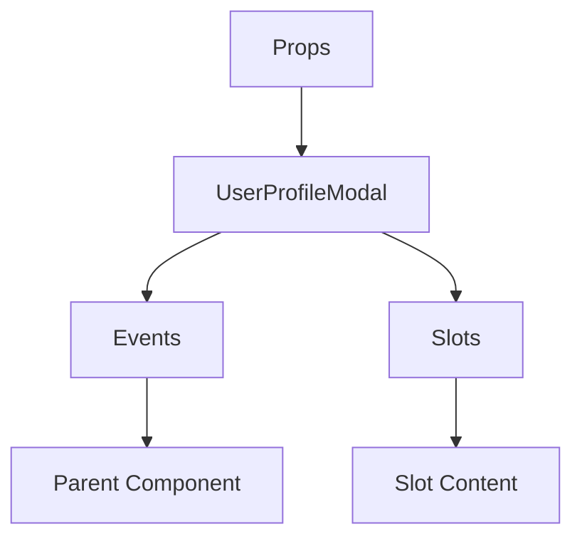

# UserProfileModal

A Vue component.

**File:** `src/components/UserProfileModal.vue`

## Overview



## Props

| Name | Type | Default | Required | Description |
|------|------|---------|----------|-------------|
| `show` | `boolean` | `undefined` | ✅ | No description |
| `user` | `union` | `undefined` | ✅ | No description |

### Props Details

#### `show`

No description available.

- **Type:** `boolean`
- **Required:** Yes
- **Default:** `undefined`


#### `user`

No description available.

- **Type:** `union`
- **Required:** Yes
- **Default:** `undefined`


## Events

| Name | Parameters | Description |
|------|------------|-------------|
| `close` | `unknown` | No description |
| `invite` | `unknown` | No description |
| `follow` | `unknown` | No description |
| `unfollow` | `unknown` | No description |
| `mention` | `unknown` | No description |

### Event Details

#### `close`

No description available.

**Parameters:** `unknown`


#### `invite`

No description available.

**Parameters:** `unknown`


#### `follow`

No description available.

**Parameters:** `unknown`


#### `unfollow`

No description available.

**Parameters:** `unknown`


#### `mention`

No description available.

**Parameters:** `unknown`


## Slots

This component has no slots.

## Methods

This component exposes no public methods.

## Usage Example

```vue
<template>
  <UserProfileModal
    :show="true"
    :user="undefined"
    @close="handleClose"
    @invite="handleInvite"
    @follow="handleFollow"
    @unfollow="handleUnfollow"
    @mention="handleMention" />
</template>

<script setup lang="ts">
const handleClose = (data: unknown) => {
  // Handle close event
}

const handleInvite = (data: unknown) => {
  // Handle invite event
}

const handleFollow = (data: unknown) => {
  // Handle follow event
}

const handleUnfollow = (data: unknown) => {
  // Handle unfollow event
}

const handleMention = (data: unknown) => {
  // Handle mention event
}
</script>
```


## File Location

`src/components/UserProfileModal.vue`

---

*This documentation was automatically generated from the component source code.*