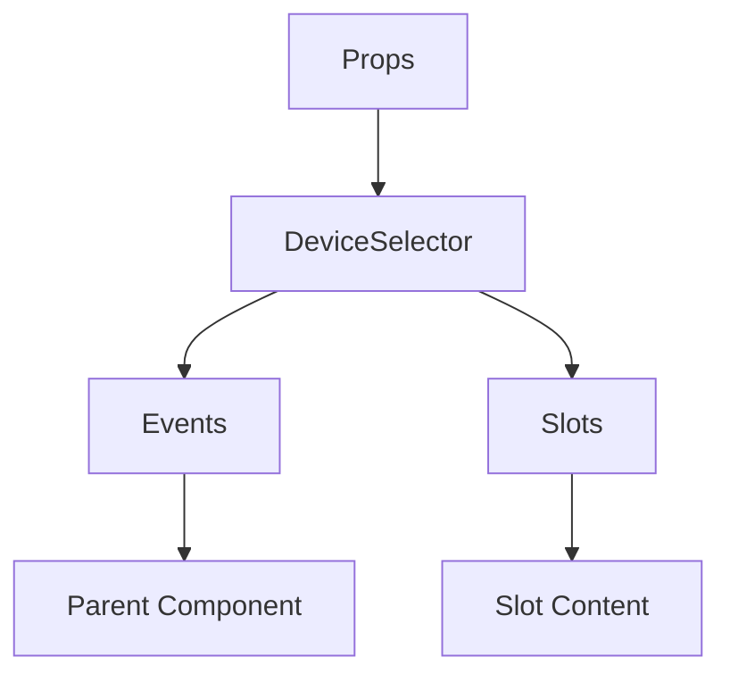

# DeviceSelector

A Vue component.

**File:** `src/components/voice/DeviceSelector.vue`

## Overview



## Props

| Name | Type | Default | Required | Description |
|------|------|---------|----------|-------------|
| `type` | `union` | `'all'` | ❌ | No description |

### Props Details

#### `type`

No description available.

- **Type:** `union`
- **Required:** No
- **Default:** `'all'`


## Events

| Name | Parameters | Description |
|------|------------|-------------|
| `open-settings` | `unknown` | No description |

### Event Details

#### `open-settings`

No description available.

**Parameters:** `unknown`


## Slots

This component has no slots.

## Methods

This component exposes no public methods.

## Usage Example

```vue
<template>
  <DeviceSelector
    
    @open-settings="handleOpenSettings" />
</template>

<script setup lang="ts">
const handleOpenSettings = (data: unknown) => {
  // Handle open-settings event
}
</script>
```


## File Location

`src/components/voice/DeviceSelector.vue`

---

*This documentation was automatically generated from the component source code.*