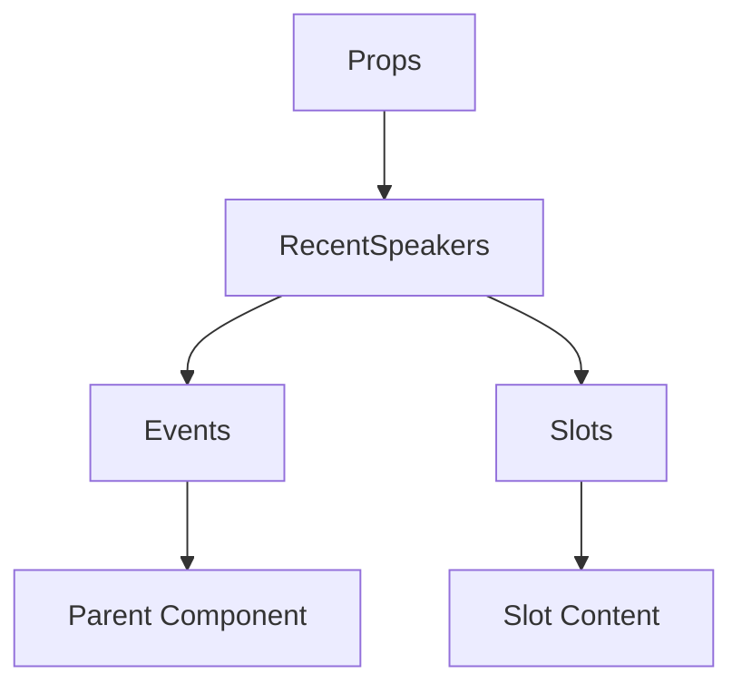

# RecentSpeakers

A Vue component.

**File:** `src/components/voice/RecentSpeakers.vue`

## Overview



## Props

| Name | Type | Default | Required | Description |
|------|------|---------|----------|-------------|
| `maxSpeakers` | `number` | `5` | ❌ | No description |

### Props Details

#### `maxSpeakers`

No description available.

- **Type:** `number`
- **Required:** No
- **Default:** `5`


## Events

This component emits no events.

## Slots

This component has no slots.

## Methods

This component exposes no public methods.

## Usage Example

```vue
<template>
  <RecentSpeakers
     />
</template>

<script setup lang="ts">
// No event handlers needed
</script>
```


## File Location

`src/components/voice/RecentSpeakers.vue`

---

*This documentation was automatically generated from the component source code.*