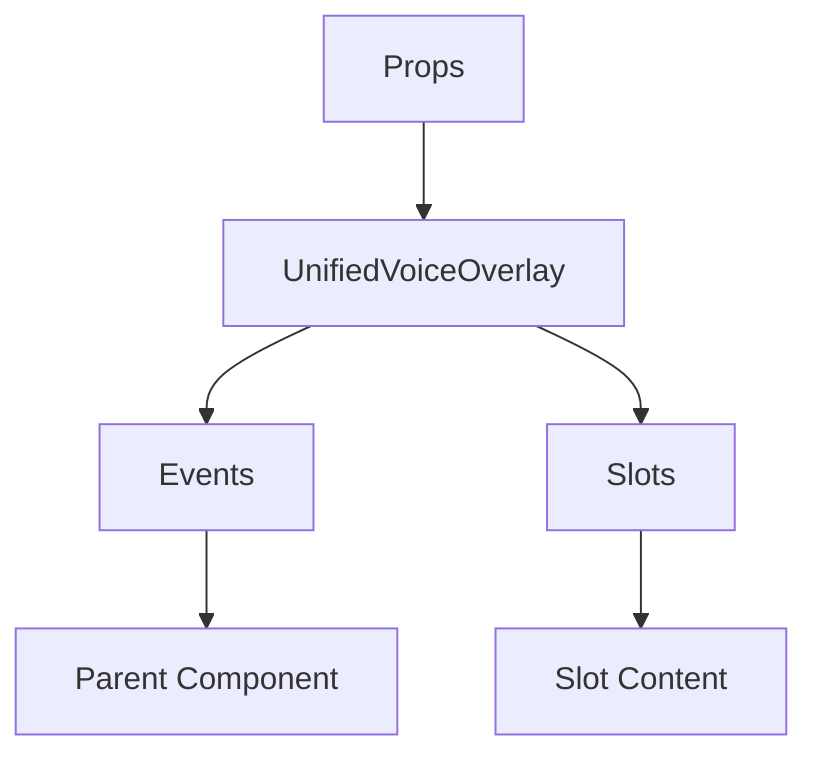

# UnifiedVoiceOverlay

A Vue component.

**File:** `src/components/voice/UnifiedVoiceOverlay.vue`

## Overview



## Props

| Name | Type | Default | Required | Description |
|------|------|---------|----------|-------------|
| `channelName` | `string` | `'Voice Channel'` | ❌ | No description |

### Props Details

#### `channelName`

No description available.

- **Type:** `string`
- **Required:** No
- **Default:** `'Voice Channel'`


## Events

| Name | Parameters | Description |
|------|------------|-------------|
| `close` | `unknown` | No description |
| `minimize` | `unknown` | No description |

### Event Details

#### `close`

No description available.

**Parameters:** `unknown`


#### `minimize`

No description available.

**Parameters:** `unknown`


## Slots

This component has no slots.

## Methods

This component exposes no public methods.

## Usage Example

```vue
<template>
  <UnifiedVoiceOverlay
    
    @close="handleClose"
    @minimize="handleMinimize" />
</template>

<script setup lang="ts">
const handleClose = (data: unknown) => {
  // Handle close event
}

const handleMinimize = (data: unknown) => {
  // Handle minimize event
}
</script>
```


## File Location

`src/components/voice/UnifiedVoiceOverlay.vue`

---

*This documentation was automatically generated from the component source code.*