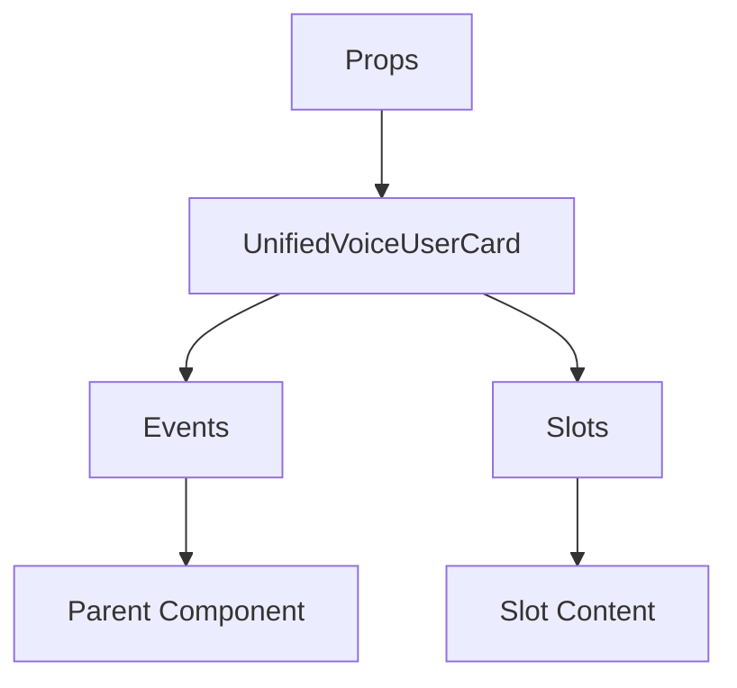

# UnifiedVoiceUserCard

A Vue component.

**File:** `src/components/voice/UnifiedVoiceUserCard.vue`

## Overview



## Props

| Name | Type | Default | Required | Description |
|------|------|---------|----------|-------------|
| `userState` | `UserMediaState` | `undefined` | ✅ | No description |

### Props Details

#### `userState`

No description available.

- **Type:** `UserMediaState`
- **Required:** Yes
- **Default:** `undefined`


## Events

| Name | Parameters | Description |
|------|------------|-------------|
| `toggle-video` | `unknown` | No description |
| `toggle-screen-share` | `unknown` | No description |

### Event Details

#### `toggle-video`

No description available.

**Parameters:** `unknown`


#### `toggle-screen-share`

No description available.

**Parameters:** `unknown`


## Slots

This component has no slots.

## Methods

This component exposes no public methods.

## Usage Example

```vue
<template>
  <UnifiedVoiceUserCard
    :userState="undefined"
    @toggle-video="handleToggleVideo"
    @toggle-screen-share="handleToggleScreenShare" />
</template>

<script setup lang="ts">
const handleToggleVideo = (data: unknown) => {
  // Handle toggle-video event
}

const handleToggleScreenShare = (data: unknown) => {
  // Handle toggle-screen-share event
}
</script>
```


## File Location

`src/components/voice/UnifiedVoiceUserCard.vue`

---

*This documentation was automatically generated from the component source code.*