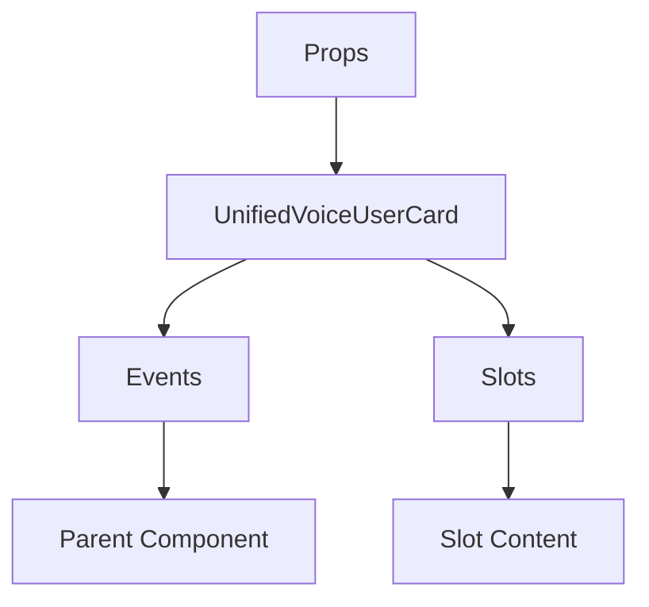

# UnifiedVoiceUserCard

No description available.

**File:** `src/components/voice/UnifiedVoiceUserCard.vue`

## Overview


```mermaid
graph TB
    PROPS[Props] --> COMPONENT[UnifiedVoiceUserCard]
    COMPONENT --> EVENTS[Events]
    COMPONENT --> SLOTS[Slots]
    EVENTS --> PARENT[Parent Component]
    SLOTS --> CONTENT[Slot Content]
```

## Props

| Name | Type | Default | Required | Description |
|------|------|---------|----------|-------------|
| `userState` | `UserMediaState` | `undefined` | ✅ | No description |
| `userProfile` | `object` | `undefined` | ✅ | No description |
| `userStream` | `MediaStream` | `null` | ❌ | No description |
| `isSelf` | `boolean` | `false` | ❌ | No description |
| `connectionState` | `string` | `'connected'` | ❌ | No description |

### Props Details

#### `userState`

No description available.

- **Type:** `UserMediaState`
- **Required:** Yes
- **Default:** `undefined`


#### `userProfile`

No description available.

- **Type:** `object`
- **Required:** Yes
- **Default:** `undefined`


#### `userStream`

No description available.

- **Type:** `MediaStream`
- **Required:** No
- **Default:** `null`


#### `isSelf`

No description available.

- **Type:** `boolean`
- **Required:** No
- **Default:** `false`


#### `connectionState`

No description available.

- **Type:** `string`
- **Required:** No
- **Default:** `'connected'`


## Events

| Name | Parameters | Description |
|------|------------|-------------|
| `toggle-video` | unknown | No description |
| `toggle-screen-share` | unknown | No description |

### Event Details

#### `toggle-video`

No description available.

**Parameters:** `unknown`


#### `toggle-screen-share`

No description available.

**Parameters:** `unknown`


## Slots

This component has no slots.

## Methods

This component exposes no public methods.

## Usage Example

```vue
<template>
  <UnifiedVoiceUserCard
    :userState="undefined"
    :userProfile="{}"
    @toggle-video="handleToggle-video"
    @toggle-screen-share="handleToggle-screen-share" />
</template>

<script setup lang="ts">
const handleToggle-video = (data) => {
  // Handle toggle-video event
}

const handleToggle-screen-share = (data) => {
  // Handle toggle-screen-share event
}
</script>
```


## File Location

`src/components/voice/UnifiedVoiceUserCard.vue`

---

*This documentation was automatically generated from the component source code.*