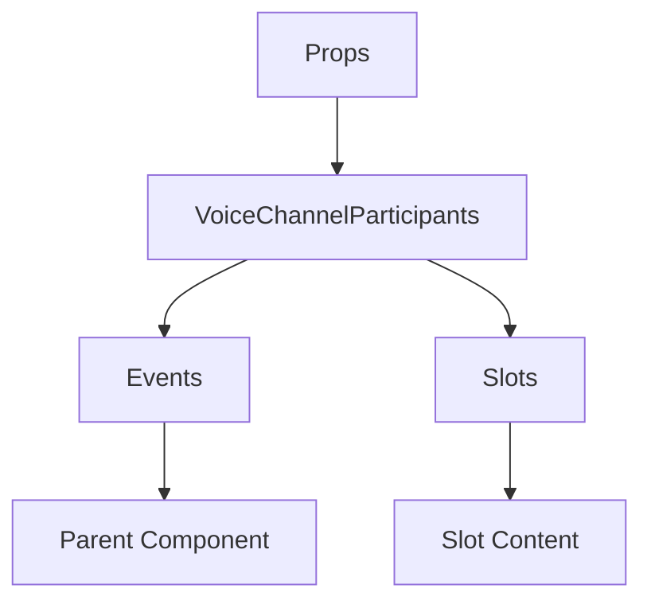

# VoiceChannelParticipants

A Vue component.

**File:** `src/components/voice/VoiceChannelParticipants.vue`

## Overview



## Props

| Name | Type | Default | Required | Description |
|------|------|---------|----------|-------------|
| `participants` | `Array` | `undefined` | ✅ | No description |
| `sessionStartTime` | `union` | `undefined` | ✅ | No description |

### Props Details

#### `participants`

No description available.

- **Type:** `Array`
- **Required:** Yes
- **Default:** `undefined`


#### `sessionStartTime`

No description available.

- **Type:** `union`
- **Required:** Yes
- **Default:** `undefined`


## Events

This component emits no events.

## Slots

This component has no slots.

## Methods

This component exposes no public methods.

## Usage Example

```vue
<template>
  <VoiceChannelParticipants
    :participants="[]"
    :sessionStartTime="undefined" />
</template>

<script setup lang="ts">
// No event handlers needed
</script>
```


## File Location

`src/components/voice/VoiceChannelParticipants.vue`

---

*This documentation was automatically generated from the component source code.*