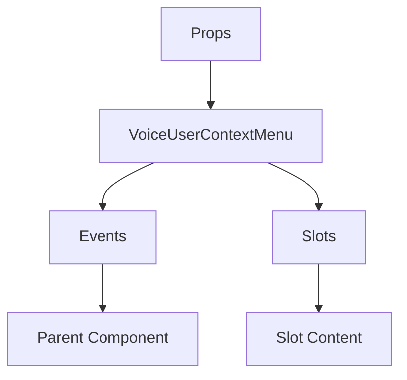

# VoiceUserContextMenu

A Vue component.

**File:** `src/components/voice/VoiceUserContextMenu.vue`

## Overview



## Props

| Name | Type | Default | Required | Description |
|------|------|---------|----------|-------------|
| `userState` | `UserMediaState` | `undefined` | ✅ | No description |
| `x` | `number` | `undefined` | ✅ | No description |
| `y` | `number` | `undefined` | ✅ | No description |
| `visible` | `boolean` | `undefined` | ✅ | No description |

### Props Details

#### `userState`

No description available.

- **Type:** `UserMediaState`
- **Required:** Yes
- **Default:** `undefined`


#### `x`

No description available.

- **Type:** `number`
- **Required:** Yes
- **Default:** `undefined`


#### `y`

No description available.

- **Type:** `number`
- **Required:** Yes
- **Default:** `undefined`


#### `visible`

No description available.

- **Type:** `boolean`
- **Required:** Yes
- **Default:** `undefined`


## Events

| Name | Parameters | Description |
|------|------------|-------------|
| `close` | `unknown` | No description |

### Event Details

#### `close`

No description available.

**Parameters:** `unknown`


## Slots

This component has no slots.

## Methods

This component exposes no public methods.

## Usage Example

```vue
<template>
  <VoiceUserContextMenu
    :userState="undefined"
    :x="42"
    :y="42"
    :visible="true"
    @close="handleClose" />
</template>

<script setup lang="ts">
const handleClose = (data: unknown) => {
  // Handle close event
}
</script>
```


## File Location

`src/components/voice/VoiceUserContextMenu.vue`

---

*This documentation was automatically generated from the component source code.*