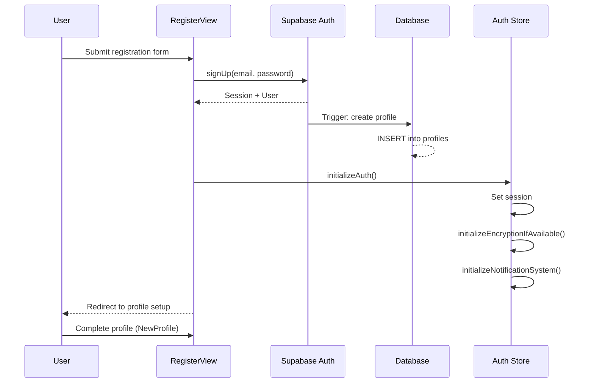
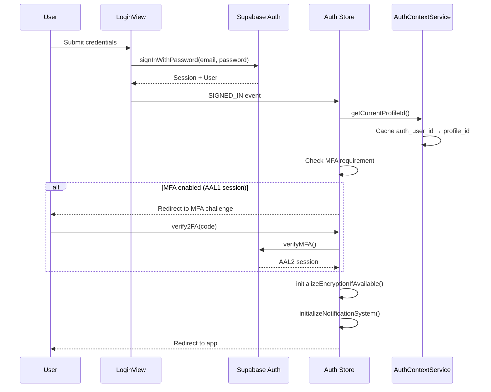
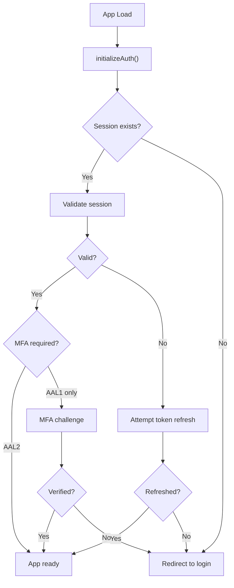
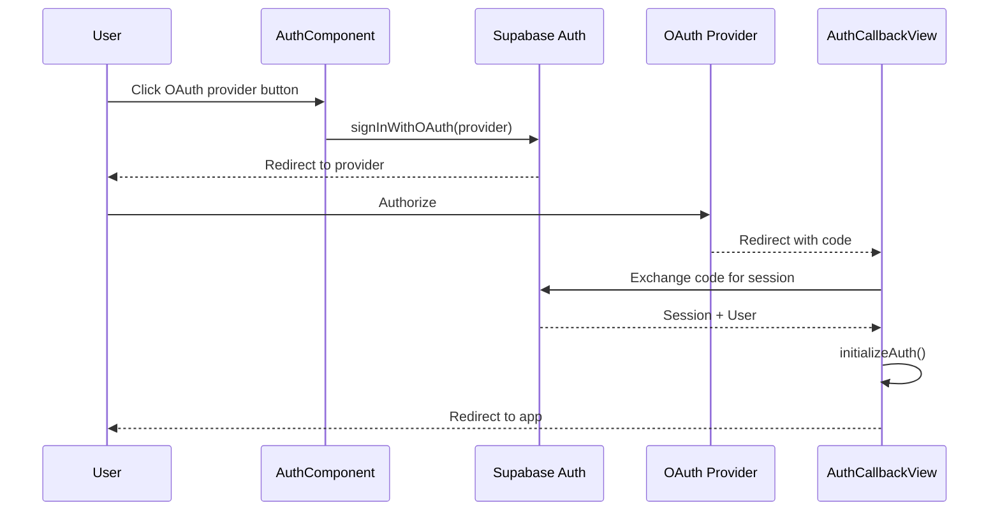
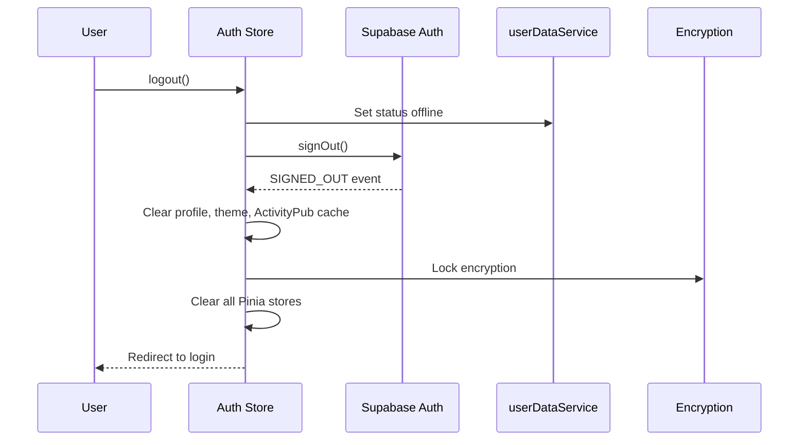

# Authentication Flow

## Overview

Harmony uses Supabase Auth for authentication, supporting email/password, OAuth providers, and MFA (two-factor authentication). The auth state is managed by the `auth` Pinia store and `AuthContextService`.

## Registration Flow

## Login Flow

## Session Management

### Token Refresh

Supabase handles JWT refresh automatically. The auth store listens for `TOKEN_REFRESHED` events and updates the cached session. A session cache (~5 seconds) prevents excessive `getSession()` calls.

### Auth State Events

The auth store listens to Supabase auth state changes:

| Event | Action |
|-------|--------|
| `SIGNED_IN` | Cache profile, init encryption, init notifications |
| `SIGNED_OUT` | Clear all state, lock encryption, set offline |
| `PASSWORD_RECOVERY` | Set password reset mode |
| `TOKEN_REFRESHED` | Update cached session |
| `USER_UPDATED` | Clear AuthContextService cache |
| `MFA_CHALLENGE_VERIFIED` | Clear MFA validation cache |
| `INITIAL_SESSION` | Initial load session setup |

## OAuth Flow

Supported providers are configured via `VITE_ENABLED_OAUTH_PROVIDERS` (e.g., `google,github,twitch`).

## Logout Flow

## AuthContextService

`AuthContextService` is a singleton that caches the mapping from `auth_user_id` to `profile_id`:

- `getCurrentProfileId()` - Returns the profile ID, using cache when available
- `getCurrentAuthUser()` - Returns the Supabase auth user
- `isAuthenticated()` - Check if a valid session exists
- Cache is cleared on `SIGNED_OUT`, `USER_UPDATED`, and relevant `SIGNED_IN` events

This service is used by all other services that need to identify the current user, avoiding redundant database queries.

---

*See also: [Real-time Updates](./realtime) for how auth state changes affect realtime subscriptions.*
