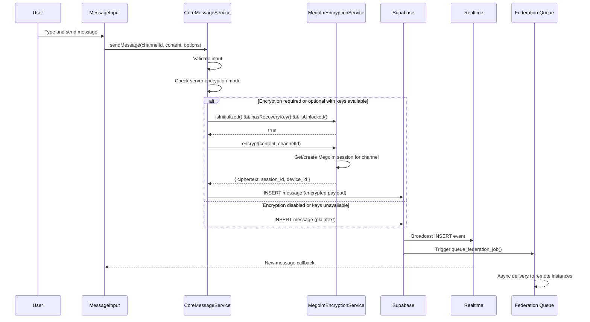
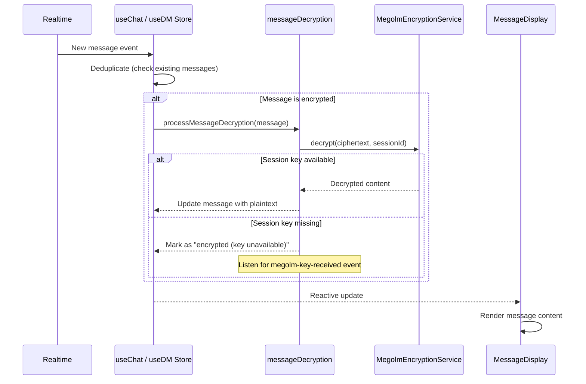
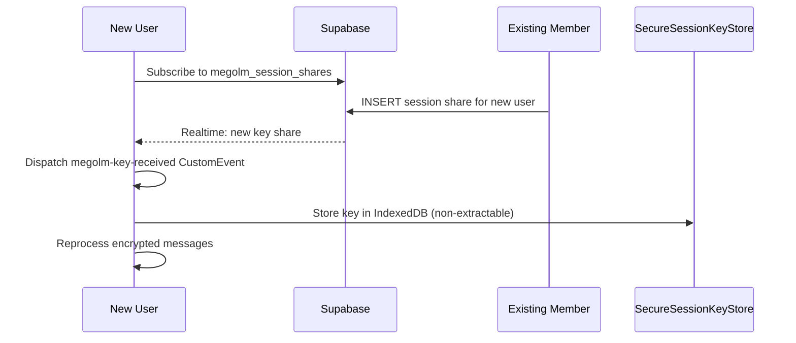
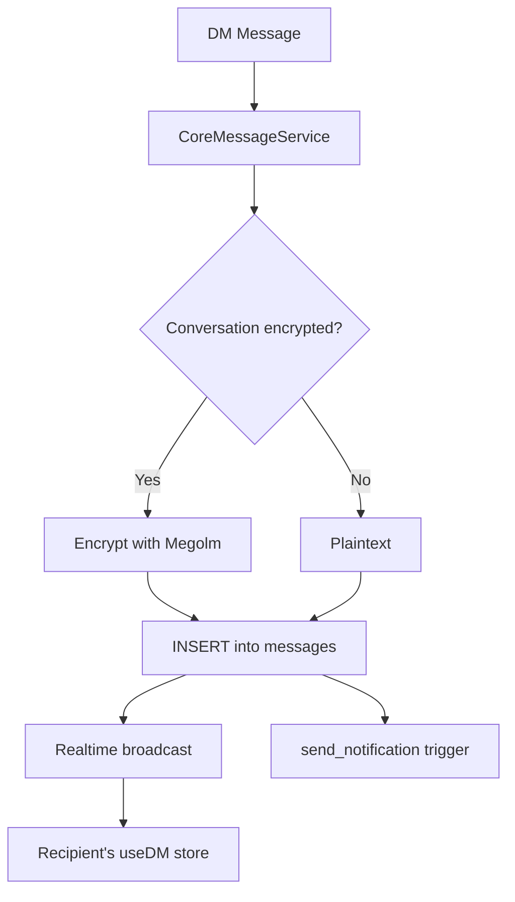
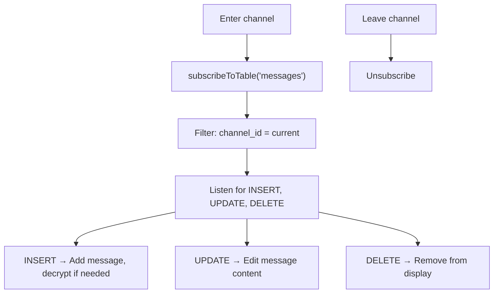

# Chat Message Flow

## Overview

Message sending in Harmony flows through `CoreMessageService`, which handles encryption decisions, database insertion, and relies on Supabase Realtime for delivery to other clients. Federation of messages is handled asynchronously by database triggers.

## Sending a Message

## Receiving a Message

## Encryption Key Sharing

When a user joins an encrypted channel, they need the Megolm session key:

## Thread Messages

Thread messages use `ThreadService` and bypass encryption entirely - they are always sent as plaintext directly to the database.

## DM Messages

DM (direct message) flow is similar to channel messages but uses the `useDM` store:

## Message Display

`MessageDisplay` renders the message list with:

- Virtual scrolling for performance (only visible messages rendered)
- Markdown/rich content rendering via `MessageContent` / `UnifiedMessageContent`
- Inline embeds (links, server invites, media)
- Reactions display and interaction
- Reply context and threading indicators
- Encryption status indicator per message

## Realtime Subscription

The chat store subscribes to messages via `RealtimeConnectionManager`:

## Server Encryption Modes

| Mode | Behavior |
|------|----------|
| `disabled` | All messages plaintext, encryption UI hidden |
| `optional` | Encrypt if keys available, fall back to plaintext |
| `required` | Block send if encryption not set up |

---

*See also: [Authentication Flow](./auth) for how sessions work, and [Real-time Updates](./realtime) for subscription management.*
