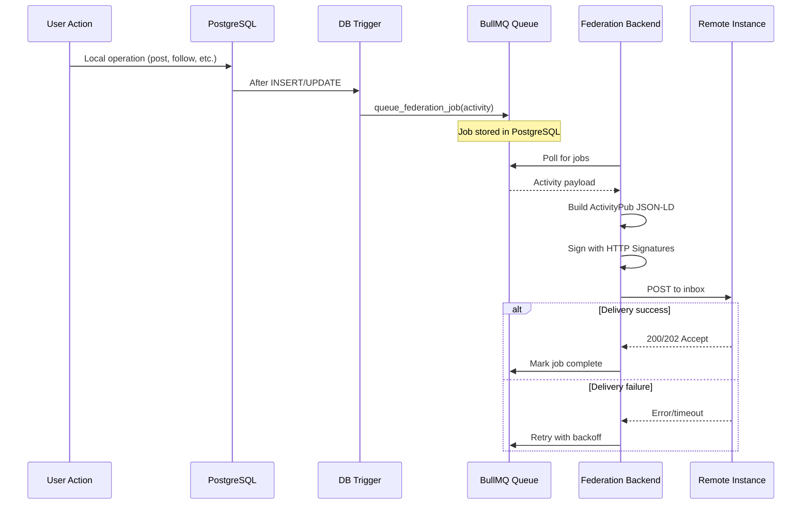
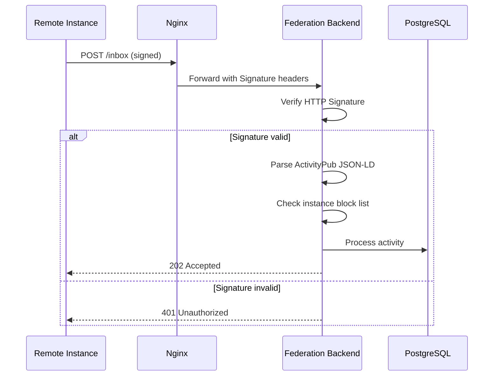
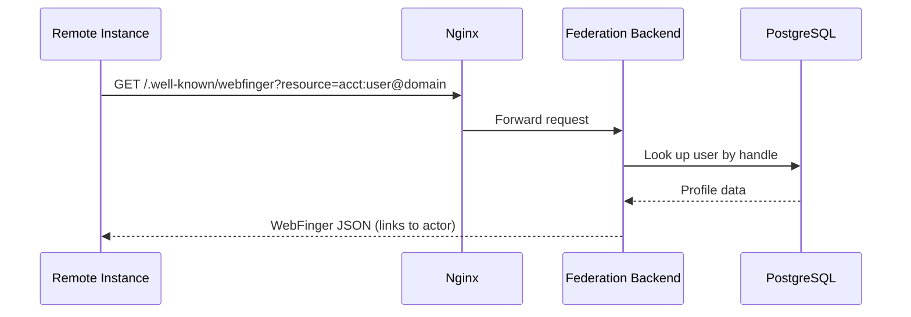
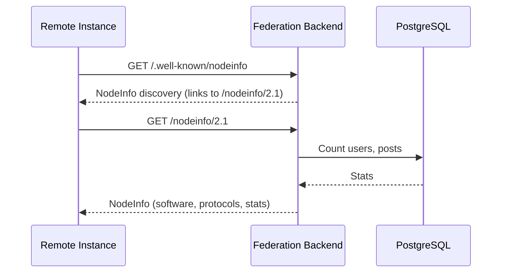
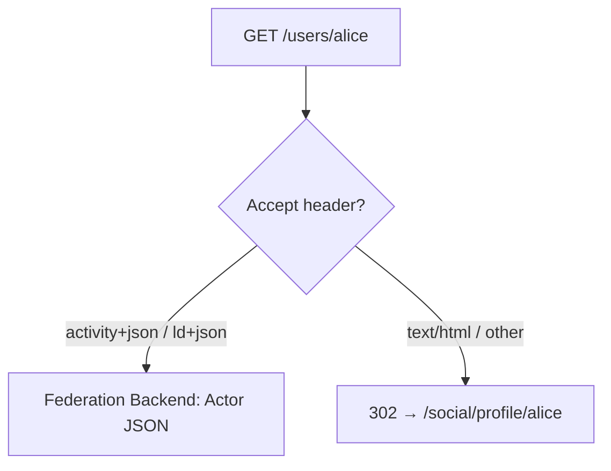

# Federation Flow

## Overview

Harmony federates with other ActivityPub-compatible platforms (Mastodon, Pleroma, Misskey, etc.) through a Node.js federation backend. Local database operations trigger federation activities asynchronously via a job queue.

## Outbound Federation

### Federated Activity Types

| Local Action | ActivityPub Activity |
|-------------|---------------------|
| Create post | `Create` → `Note` |
| Edit post | `Update` → `Note` |
| Delete post | `Delete` → `Note` |
| Follow user | `Follow` |
| Unfollow | `Undo` → `Follow` |
| Favorite | `Like` |
| Reblog | `Announce` |
| Block | `Block` |
| Reply | `Create` → `Note` (with `inReplyTo`) |

## Inbound Federation

### Processing Inbound Activities

| Incoming Activity | Database Effect |
|------------------|-----------------|
| `Create` → `Note` | Insert into posts (federated) |
| `Follow` | Insert follow request/relationship |
| `Like` | Insert favorite |
| `Announce` | Insert reblog |
| `Delete` | Soft-delete the referenced object |
| `Undo` → `Follow` | Remove follow relationship |
| `Undo` → `Like` | Remove favorite |
| `Block` | Record block, hide content |

## Discovery

### WebFinger

Response includes links to the user's ActivityPub actor URL and profile page.

### NodeInfo

### Content Negotiation

User profile URLs (`/users/{handle}`) serve different content based on the `Accept` header:

## Server Federation (Groups)

Harmony servers are represented as ActivityPub Groups:

- Endpoint: `/servers/{id}`
- Supports Group actors with inbox/outbox
- Channel messages can be federated as group activities
- Remote users can discover and interact with server content

## Job Queue Details

### With BullMQ (`USE_BULLMQ_QUEUE=true`)

- Jobs stored in PostgreSQL (same database as application data)
- Reliable: survives server restarts
- Retry with exponential backoff on delivery failure
- `queue_federation_job()` uses `pg_notify` to bridge jobs into BullMQ

### Without BullMQ

- Database listeners process events synchronously
- Simpler but less reliable (events can be lost on restart)

## Security

- **HTTP Signatures**: All outbound requests are signed; inbound signatures are verified
- **Instance blocking**: Blocked instances (via admin panel) are rejected at the inbox
- **Instance trust**: Trusted instances get priority delivery
- **Rate limiting**: Configurable per-endpoint rate limits
- **Content sanitization**: Inbound content is sanitized before storage

---

*See also: [Authentication Flow](./auth) for user identity, and [Real-time Updates](./realtime) for how federated content reaches clients.*
