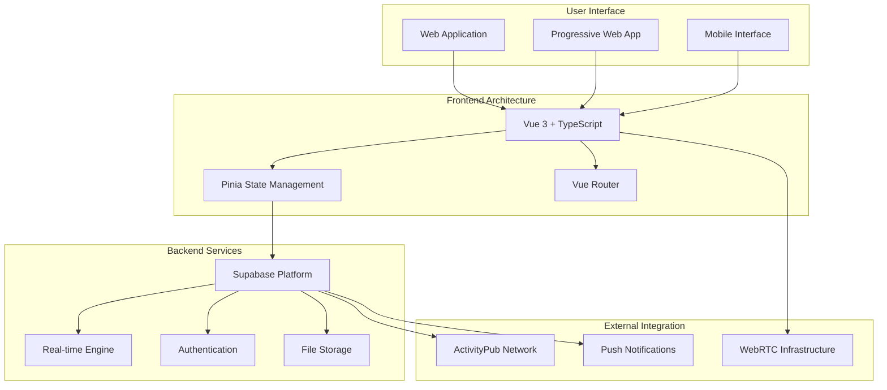
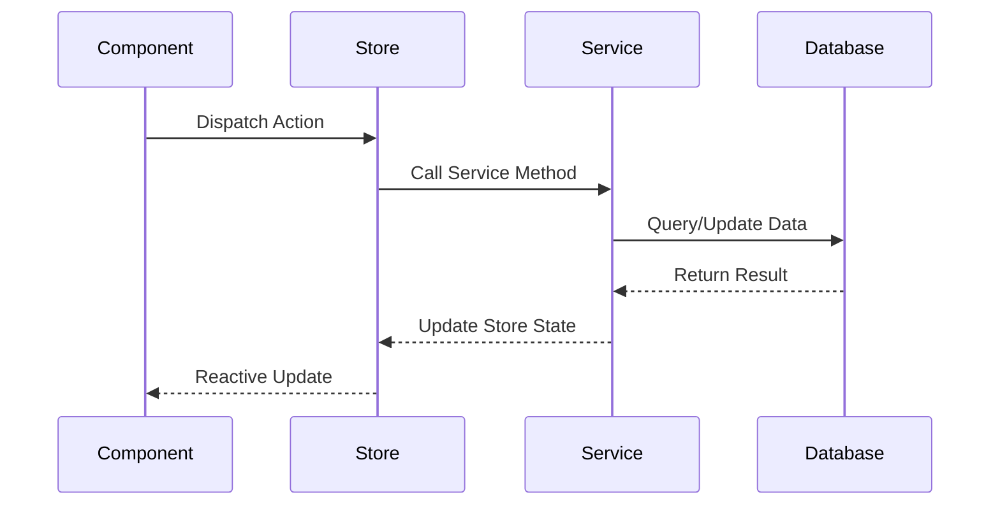
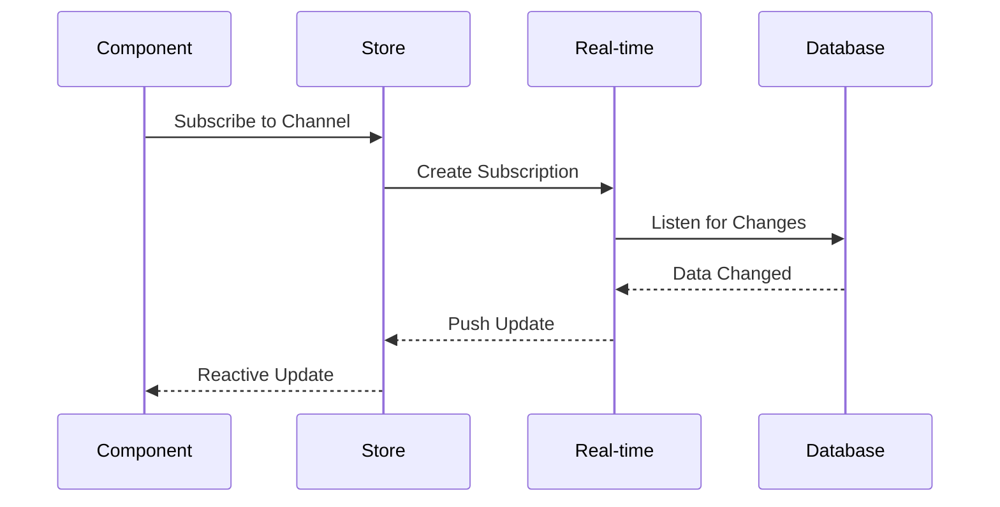
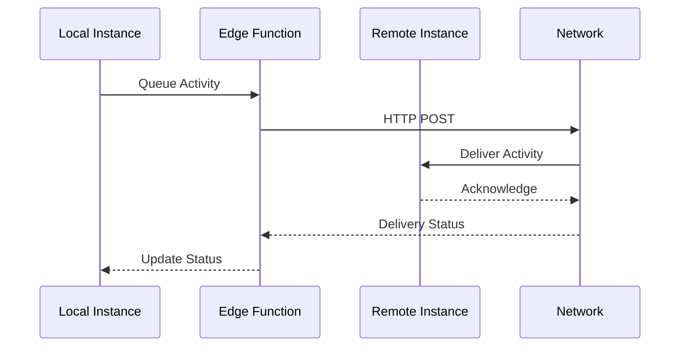
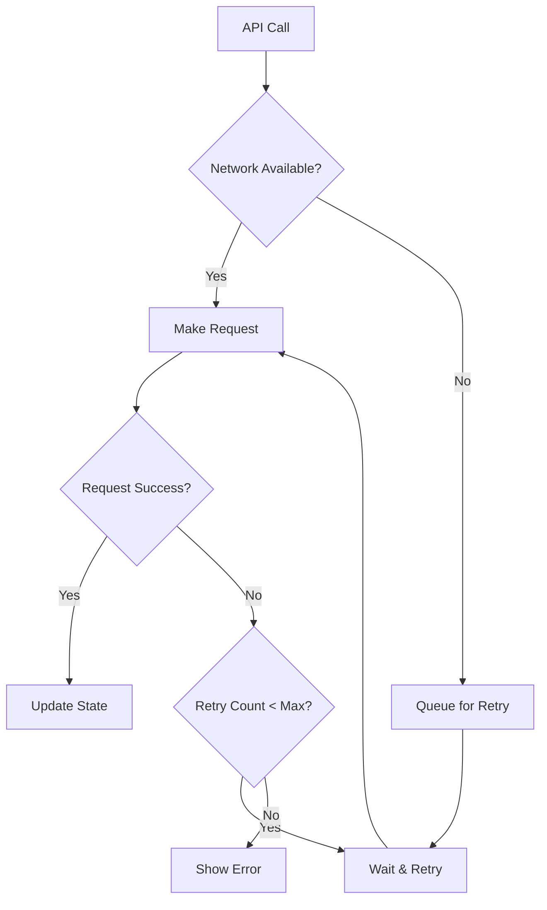
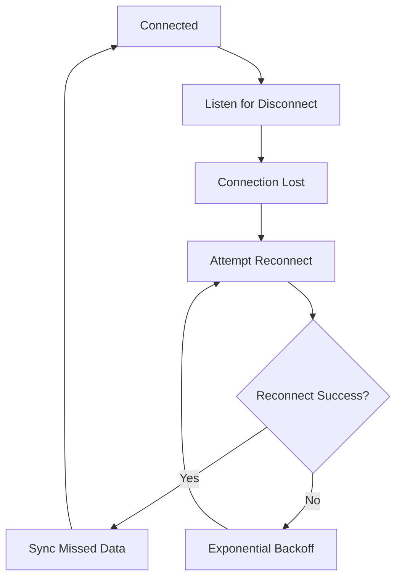
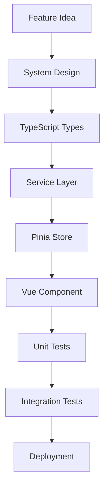
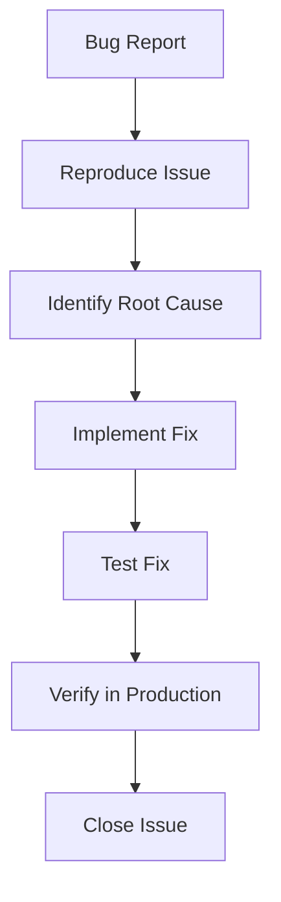

# System Architecture & Flow Diagrams

This section provides comprehensive visual documentation of how Harmony's systems interconnect and operate.

## Overview

Harmony is a complex federated social platform that combines Discord-like chat functionality with ActivityPub federation. Understanding the system flows is crucial for development, debugging, and extending the platform.

## Available Flow Diagrams

### Core System Flows

- **[Authentication Flow](/flows/auth)** - User login, registration, session management, OAuth, and MFA
- **[Chat Message Flow](/flows/chat)** - Message sending with encryption decisions, realtime delivery, and rendering
- **[Federation Flow](/flows/federation)** - ActivityPub federation, job queue, HTTP signatures, and discovery
- **[Real-time Updates](/flows/realtime)** - Supabase Realtime subscriptions, reconnection, and presence

## System Architecture Layers

### Layer 1: Presentation Layer

The Vue 3 frontend with TypeScript provides:

- Component-based UI architecture
- Reactive data binding
- Client-side routing
- Progressive Web App capabilities

### Layer 2: State Management

Pinia stores manage application state:

- Authentication state
- Chat messages and channels
- Social timeline data
- User preferences and settings

### Layer 3: Service Layer

Business logic services handle:

- API communication
- Real-time subscriptions
- File processing
- Federation protocols

### Layer 4: Data Layer

Supabase backend provides:

- PostgreSQL database
- Real-time subscriptions
- Authentication services
- File storage with CDN

### Layer 5: External Services

Integration with external systems:

- ActivityPub federation network
- WebRTC for voice/video
- Push notification services
- CDN for asset delivery

## Data Flow Patterns

### Request-Response Pattern

### Real-time Subscription Pattern

### Federation Pattern

## Performance Considerations

### Caching Strategy

- **Component Level**: Vue's built-in reactivity caching
- **Store Level**: Pinia state persistence
- **Service Level**: HTTP response caching
- **Database Level**: Supabase query caching

### Optimization Techniques

- **Lazy Loading**: Components load on demand
- **Virtual Scrolling**: Efficient large list rendering
- **Debouncing**: Reduce API call frequency
- **Pagination**: Cursor-based data loading

### Real-time Efficiency

- **Channel Subscriptions**: Only subscribe to needed channels
- **Presence Batching**: Batch presence updates
- **Message Deduplication**: Prevent duplicate real-time messages
- **Connection Pooling**: Reuse WebSocket connections

## Error Handling Flows

### Network Error Recovery

### Real-time Reconnection

## Security Flows

### Authentication Security

- JWT token validation
- Refresh token rotation
- Session timeout handling
- Cross-site request forgery protection

### Federation Security

- Activity signature verification
- Instance allowlist/blocklist
- Content sanitization
- Rate limiting

### Data Protection

- Row-level security policies
- Encrypted file storage
- Privacy setting enforcement
- GDPR compliance flows

## Monitoring & Observability

### Performance Metrics

- Component render times
- API response latencies
- Real-time message delivery rates
- Federation success rates

### Error Tracking

- JavaScript error capture
- API error logging
- Federation failure tracking
- User experience metrics

### Health Monitoring

- Database connection health
- Real-time subscription status
- External service availability
- Resource utilization tracking

## Development Workflows

### Feature Development Flow

### Bug Fix Flow

## Next Steps

Choose a specific flow diagram to explore:

1. **[Authentication Flow](/flows/auth)** - User sessions, OAuth, and MFA
2. **[Chat Message Flow](/flows/chat)** - Core messaging with encryption
3. **[Federation Flow](/flows/federation)** - Cross-instance ActivityPub communication
4. **[Real-time Updates](/flows/realtime)** - Live data synchronization

---

*These diagrams are maintained alongside the codebase and updated with each architectural change.*
