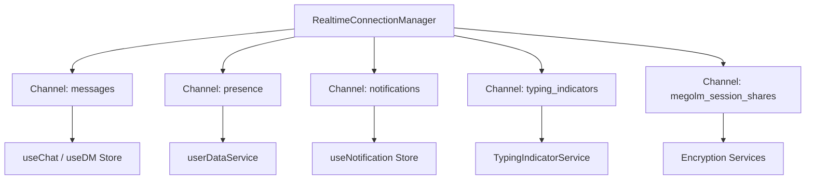
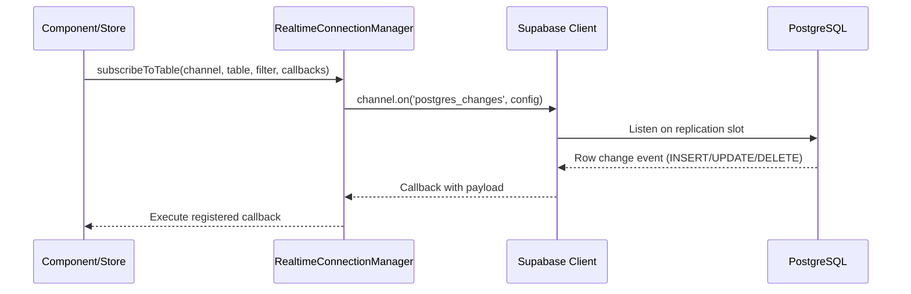
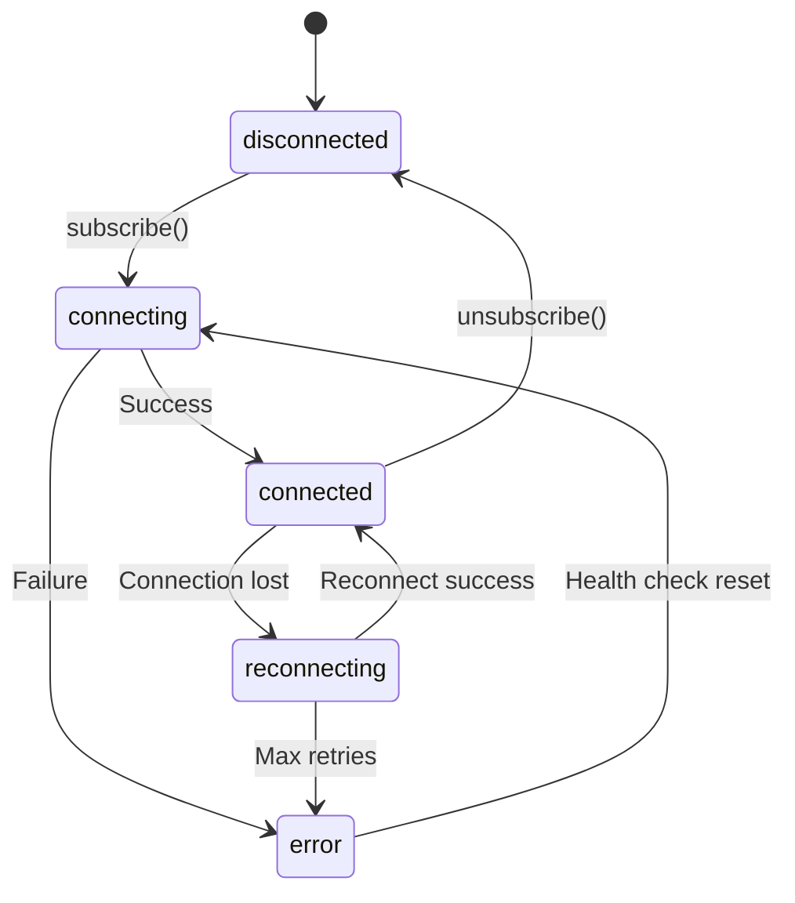
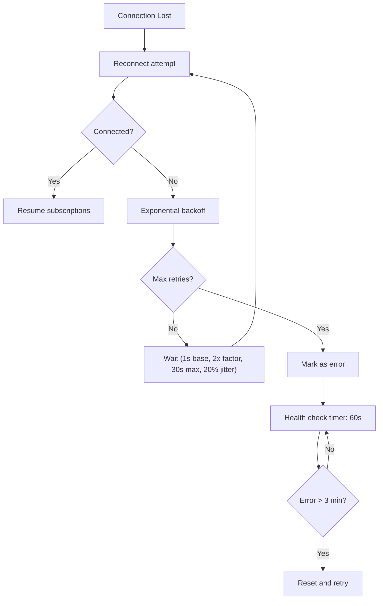
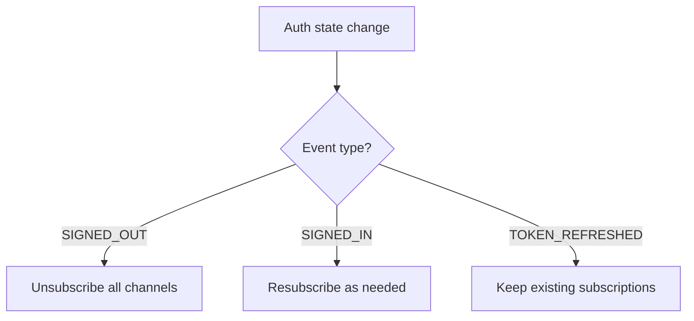
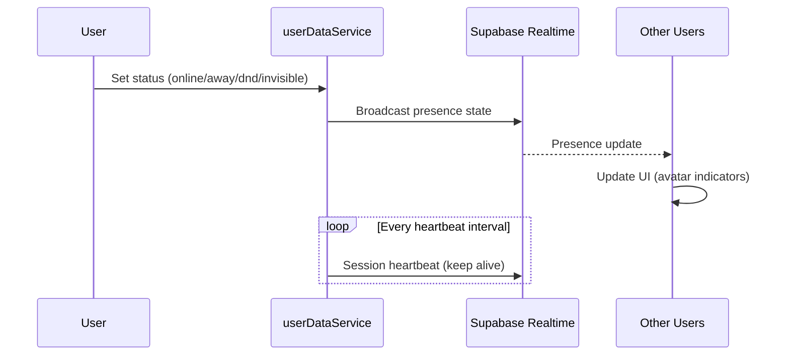

# Real-time Updates

## Overview

Harmony uses Supabase Realtime (built on PostgreSQL's replication) for live data delivery. The `RealtimeConnectionManager` service provides a resilient wrapper with automatic reconnection and status tracking.

## Subscription Architecture



## Subscribing to Tables

`RealtimeConnectionManager` provides typed subscription methods:



### Subscription Types

| Method | Use Case |
|--------|----------|
| `subscribeToTable()` | Listen for INSERT, UPDATE, DELETE on a single table |
| `subscribeToMultipleTables()` | Multiple tables on one channel |
| `subscribe()` | Legacy single-event subscription |

### Filtering

Subscriptions can filter by column values to receive only relevant events:

```typescript
manager.subscribeToTable('chat-messages', 'messages', {
  filter: `channel_id=eq.${channelId}`,
  event: 'INSERT',
  callback: (payload) => handleNewMessage(payload.new)
})
```

## Connection Lifecycle



### Per-Channel Status

Each channel tracks its own connection status:

| Status | Meaning |
|--------|---------|
| `disconnected` | Not subscribed |
| `connecting` | Initial connection attempt |
| `connected` | Actively receiving events |
| `reconnecting` | Connection lost, attempting recovery |
| `error` | Failed after max retries |

## Reconnection Strategy



### Backoff Parameters

| Parameter | Value |
|-----------|-------|
| Base delay | 1 second |
| Max delay | 30 seconds |
| Factor | 2x |
| Max retries | 10 |
| Jitter | 20% |

### Rapid Close Detection

If 3 connections close within a short period, the manager backs off for 30 seconds to avoid overwhelming the server.

## Auth Integration



On `SIGNED_OUT`, all realtime subscriptions are cleaned up immediately.

## Presence

User presence is tracked through Supabase Realtime presence channels:



### Presence States

| Status | Visible to Others | Receives Notifications |
|--------|-------------------|----------------------|
| Online | Yes | Yes |
| Away | Yes (as away) | Yes |
| Do Not Disturb | Yes (as DND) | Suppressed |
| Invisible | No (appears offline) | Yes |

## Key Realtime Channels

| Channel | Table(s) | Purpose |
|---------|----------|---------|
| Chat messages | `messages` | New/edited/deleted messages in a channel |
| DM messages | `messages` | Direct message delivery |
| Notifications | `notifications` | Real-time notification delivery |
| Typing | `typing_indicators` | Typing status in channels/DMs |
| Presence | Realtime presence | Online/offline status |
| Encryption keys | `megolm_session_shares` | Key sharing for E2EE |
| Reactions | `message_reactions` | Message reaction updates |

## Monitoring

```typescript
const manager = RealtimeConnectionManager.getInstance()

// Get debug info for all channels
const debug = manager.getDebugInfo()

// Monitor specific channel status
manager.onStatusChange('my-channel', (status) => {
  console.log('Status:', status)
})

// Get current status
const status = manager.getStatus('my-channel')
```

## Health Check

A 60-second health check timer monitors long-lived error states:

- If a channel has been in `error` status for more than 3 minutes, it resets and attempts reconnection
- This handles cases where the network recovers but the subscription wasn't automatically restored

---

*See also: [Chat Message Flow](./chat) for how messages use realtime, and [Authentication Flow](./auth) for session management.*
