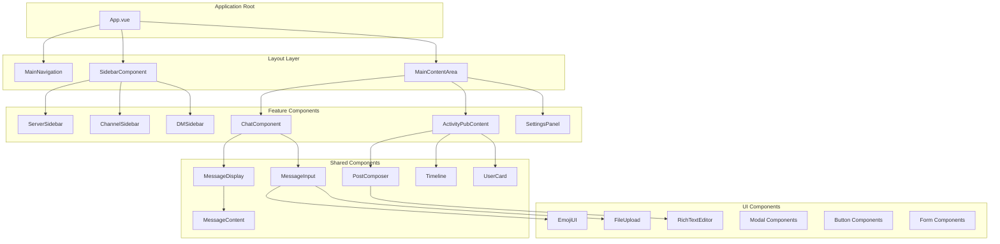
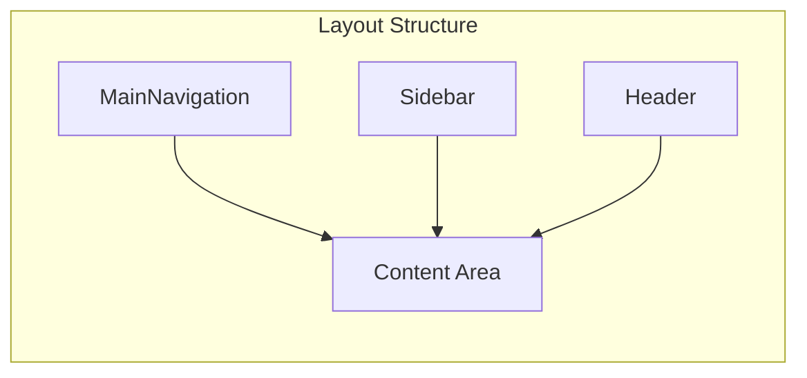
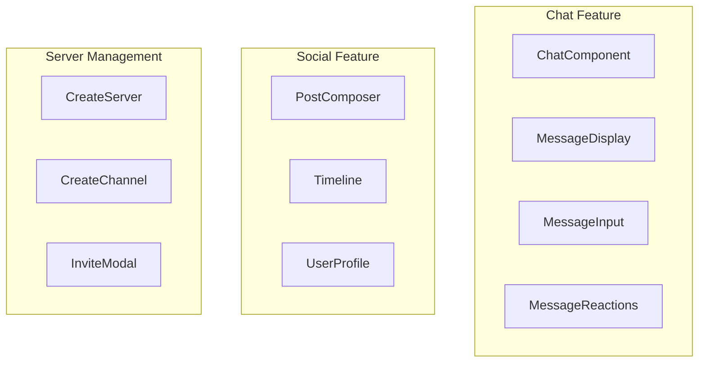
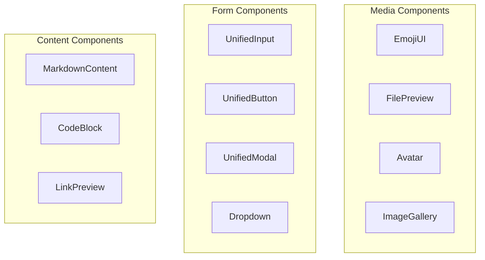
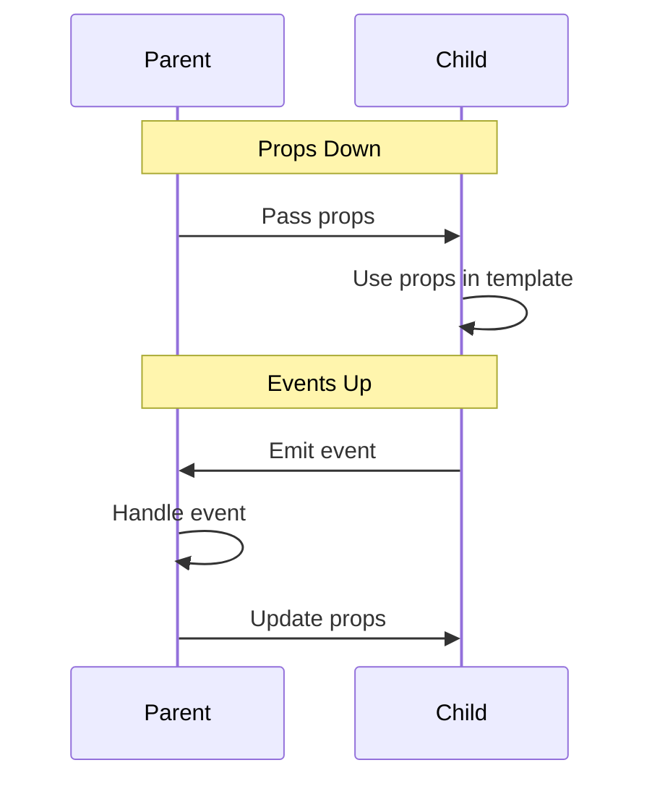
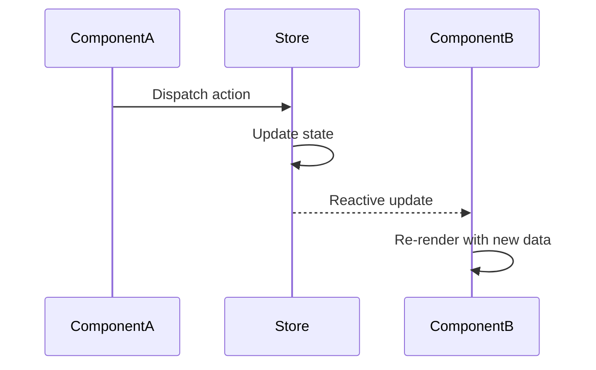
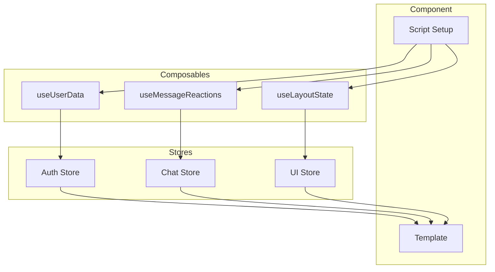
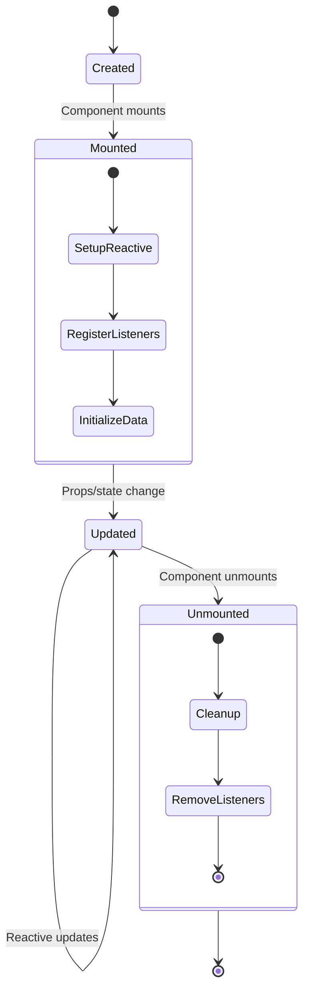
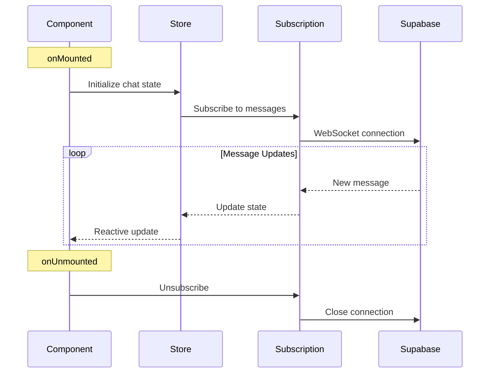

# Component Structure

Harmony's component architecture follows Vue 3 best practices with a clear hierarchy and separation of concerns.

## Component Hierarchy



## Component Categories

### 1. Layout Components

**Purpose**: Structure the application layout and provide navigation



**Key Components**:
- `MainNavigation.vue` - Primary app navigation
- `SidebarComponent.vue` - Contextual sidebar container
- `MainContentAreaHeader.vue` - Content area header

### 2. Feature Components

**Purpose**: Implement core application features



### 3. Shared Components

**Purpose**: Reusable components across features



## Component Communication Patterns

### Parent-Child Communication



### Sibling Communication via Store



### Composable Integration



## Component Lifecycle

### Standard Component Lifecycle



### Chat Component Lifecycle



## Prop Patterns

### Configuration Props

```typescript
interface ComponentProps {
  // Configuration
  mode: 'chat' | 'social' | 'voice'
  layout: 'compact' | 'comfortable' | 'spacious'
  theme: 'light' | 'dark' | 'auto'
  
  // Data props
  messages: Message[]
  users: User[]
  
  // Behavior props
  readonly: boolean
  autoScroll: boolean
  showTimestamps: boolean
}
```

### Event Props

```typescript
interface ComponentEmits {
  // User interactions
  (e: 'messageSelect', message: Message): void
  (e: 'userClick', user: User): void
  
  // State changes
  (e: 'loadMore'): void
  (e: 'scrollToBottom'): void
  
  // Data mutations
  (e: 'messageCreate', content: string): void
  (e: 'messageUpdate', id: string, content: string): void
  (e: 'messageDelete', id: string): void
}
```

## Slot Patterns

### Content Slots

```vue
<template>
  <div class="message-container">
    <!-- Default content slot -->
    <slot name="content" :message="message">
      <MessageContent :message="message" />
    </slot>
    
    <!-- Actions slot with data -->
    <slot name="actions" :message="message" :onReact="handleReact">
      <MessageActions :message="message" @react="handleReact" />
    </slot>
    
    <!-- Optional metadata slot -->
    <slot name="metadata" :message="message" />
  </div>
</template>
```

### Layout Slots

```vue
<template>
  <div class="layout-container">
    <!-- Header slot -->
    <header v-if="$slots.header">
      <slot name="header" />
    </header>
    
    <!-- Main content with sidebar -->
    <main class="main-content">
      <aside v-if="$slots.sidebar" class="sidebar">
        <slot name="sidebar" />
      </aside>
      
      <section class="content">
        <slot /> <!-- Default slot -->
      </section>
    </main>
    
    <!-- Footer slot -->
    <footer v-if="$slots.footer">
      <slot name="footer" />
    </footer>
  </div>
</template>
```

## State Management Integration

### Component Store Binding

```vue
<script setup lang="ts">
import { useChatStore } from '@/stores/useChat'
import { useAuthStore } from '@/stores/auth'

// Store bindings
const chatStore = useChatStore()
const authStore = useAuthStore()

// Computed properties from stores
const messages = computed(() => chatStore.messages)
const currentUser = computed(() => authStore.user)
const isLoading = computed(() => chatStore.isLoading)

// Store actions
const sendMessage = (content: string) => {
  chatStore.sendMessage({
    content,
    channelId: props.channelId,
    authorId: currentUser.value?.id
  })
}
</script>
```

### Reactive State Patterns

```vue
<script setup lang="ts">
// Reactive references
const searchQuery = ref('')
const selectedUsers = ref<User[]>([])
const isModalOpen = ref(false)

// Computed derived state
const filteredUsers = computed(() => {
  return users.value.filter(user => 
    user.name.toLowerCase().includes(searchQuery.value.toLowerCase())
  )
})

// Watchers for side effects
watch(searchQuery, (newQuery) => {
  if (newQuery.length > 2) {
    performSearch(newQuery)
  }
})

// Lifecycle hooks
onMounted(() => {
  fetchUsers()
})

onUnmounted(() => {
  cleanup()
})
</script>
```

## Component Testing Structure

### Component Test Patterns

```typescript
describe('ChatComponent', () => {
  beforeEach(() => {
    // Setup test store
    setActivePinia(createPinia())
  })

  test('renders messages correctly', () => {
    const messages = [
      { id: '1', content: 'Hello', author: 'User1' },
      { id: '2', content: 'World', author: 'User2' }
    ]
    
    const wrapper = mount(ChatComponent, {
      props: { messages }
    })
    
    expect(wrapper.findAll('[data-testid="message"]')).toHaveLength(2)
  })

  test('emits send event on message submit', async () => {
    const wrapper = mount(ChatComponent)
    
    await wrapper.find('[data-testid="message-input"]').setValue('Test message')
    await wrapper.find('[data-testid="send-button"]').trigger('click')
    
    expect(wrapper.emitted('messageCreate')).toBeTruthy()
    expect(wrapper.emitted('messageCreate')[0]).toEqual(['Test message'])
  })
})
```

This component structure ensures:
- **Maintainability**: Clear separation of concerns
- **Reusability**: Shared components across features
- **Testability**: Well-defined interfaces and props
- **Performance**: Efficient reactivity and lifecycle management
- **Type Safety**: TypeScript integration throughout
