# Data Flow

Understanding how data flows through Harmony is crucial for development and debugging.

## Overview

Harmony follows a unidirectional data flow pattern with reactive state management:

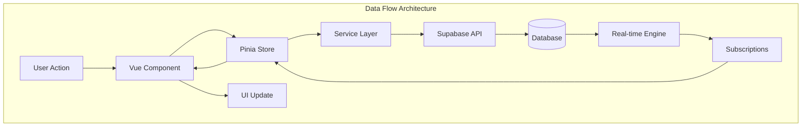

## Message Flow

### Chat Message Lifecycle

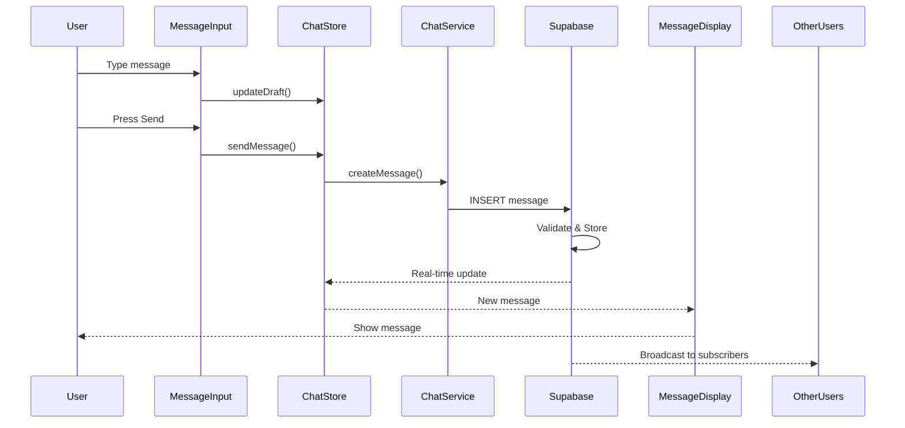

### Message State Flow

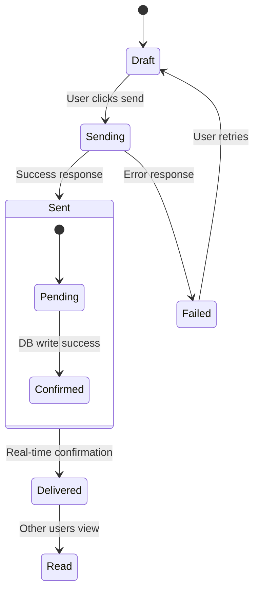

## Federation Data Flow

### ActivityPub Message Propagation

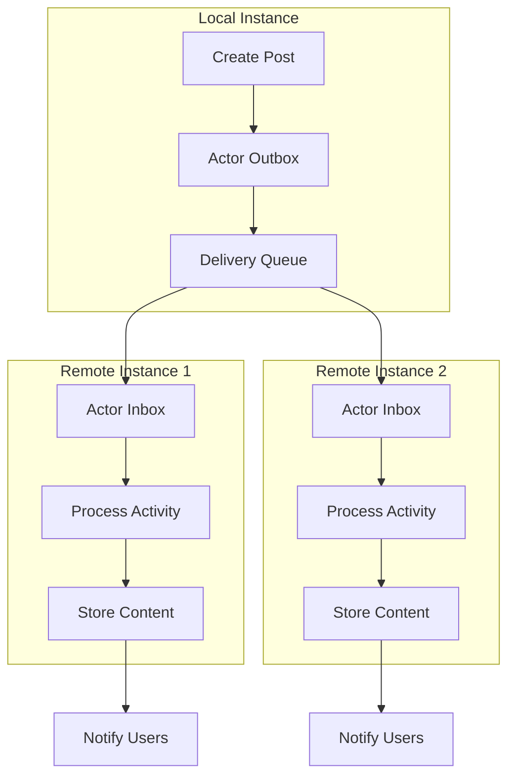

### Cross-Instance Communication

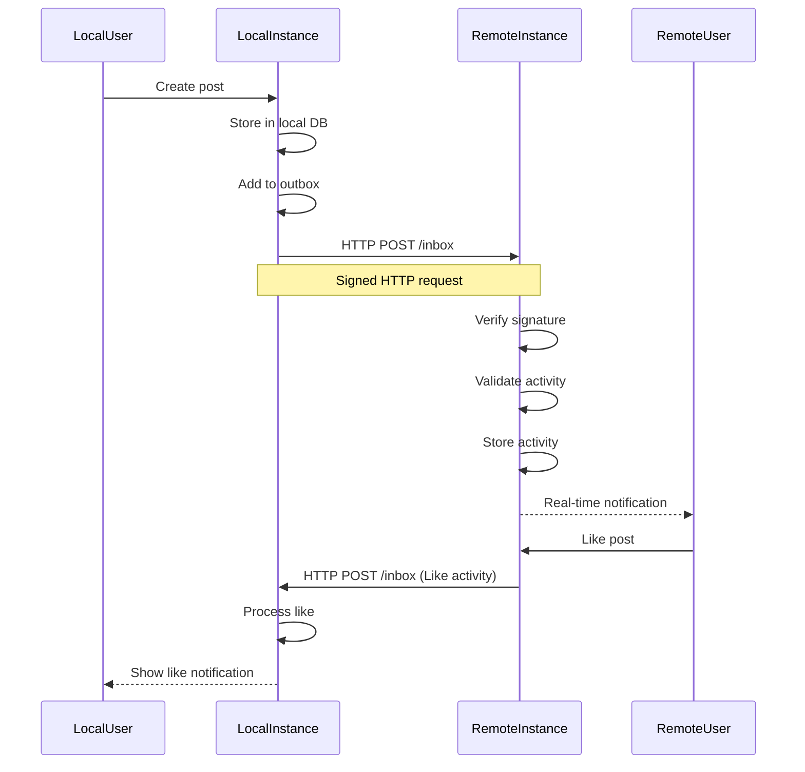

## State Management Flow

### Pinia Store Architecture

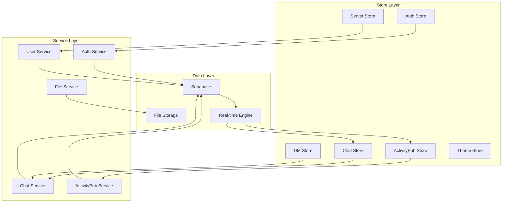

### Store Interaction Patterns

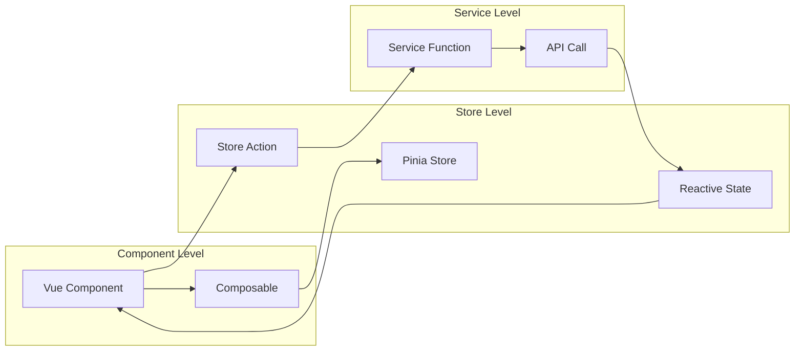

## Real-time Data Synchronization

### Subscription Management

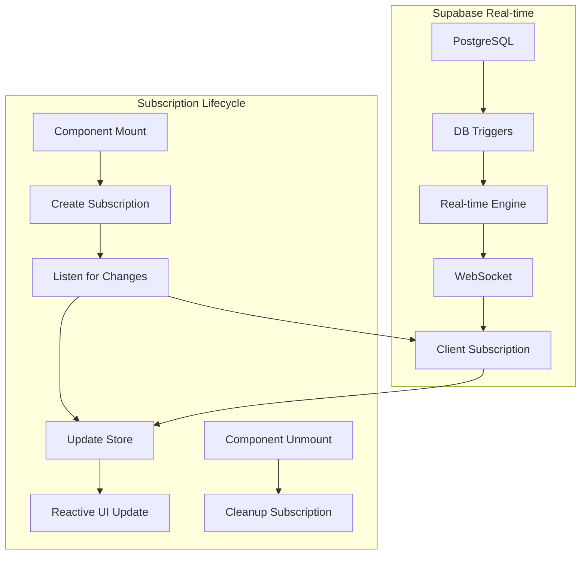

### Real-time Event Flow

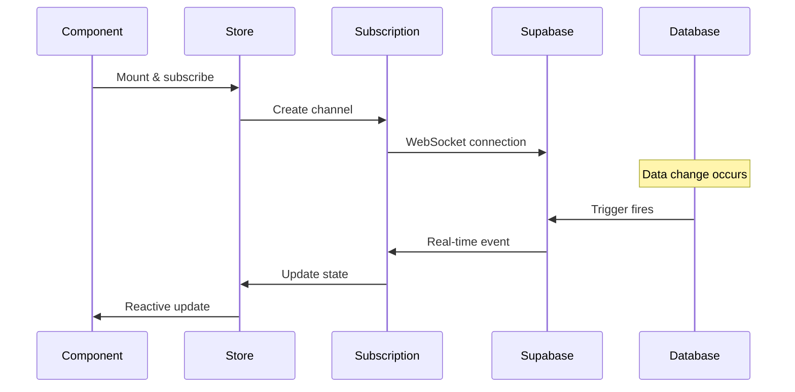

## File Upload Flow

### File Processing Pipeline

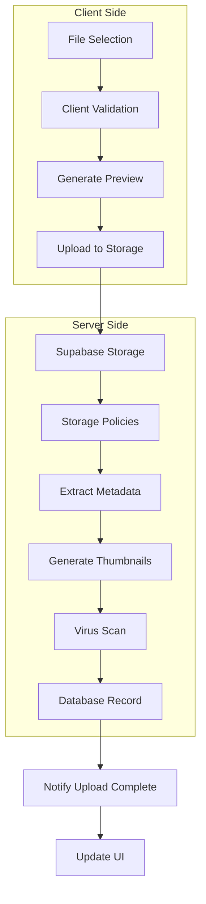

### Upload State Management

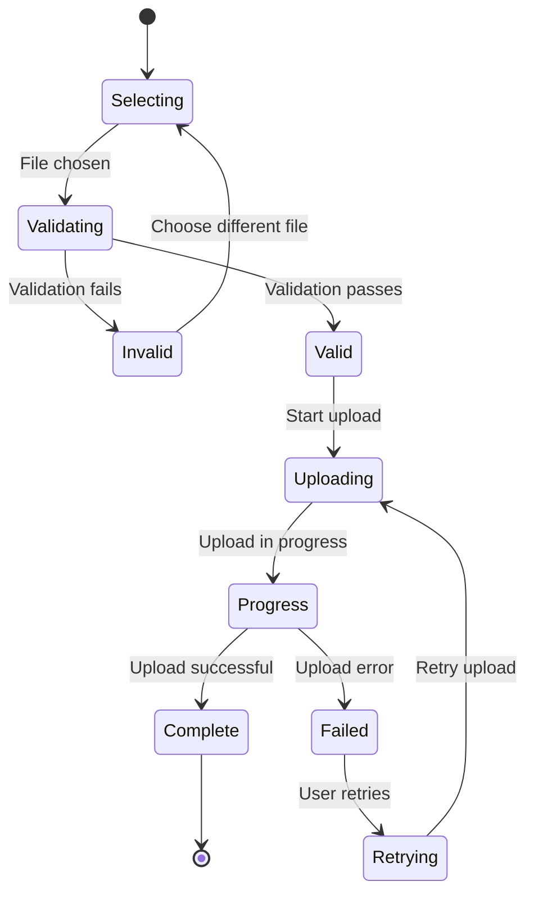

## Error Handling Flow

### Error Propagation

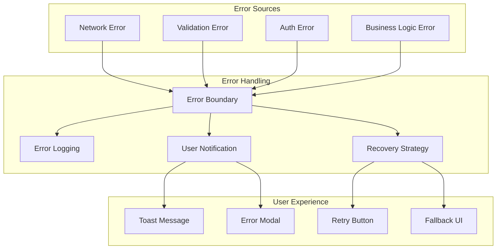

## Performance Optimization Flow

### Caching Strategy

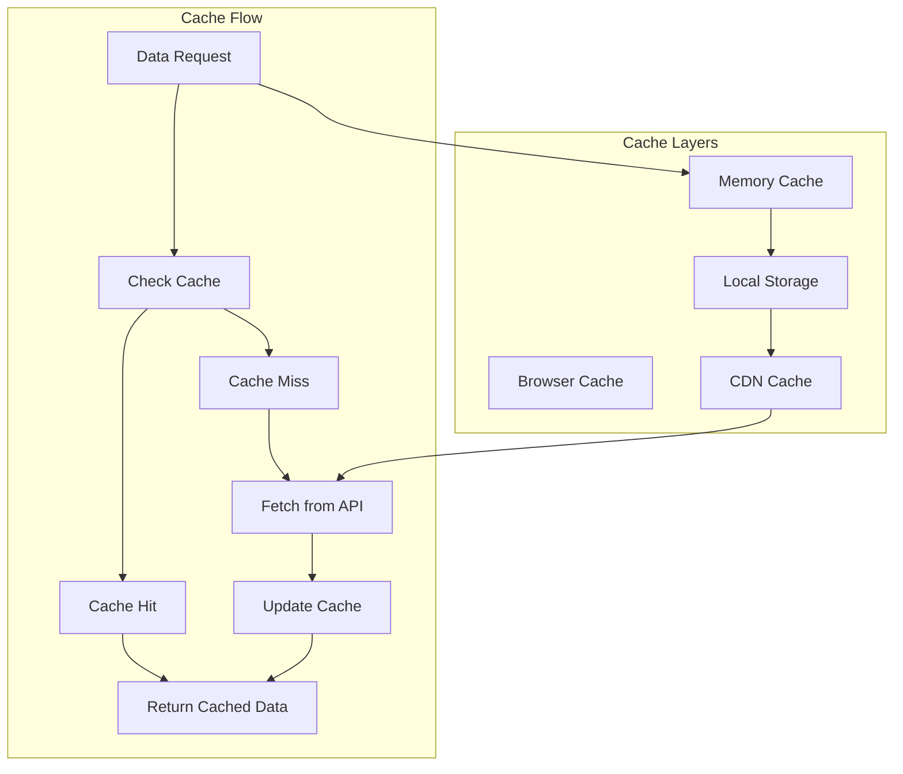

This data flow architecture ensures:
- **Predictable State**: Unidirectional flow makes debugging easier
- **Real-time Updates**: Immediate synchronization across clients
- **Error Resilience**: Robust error handling and recovery
- **Performance**: Efficient caching and optimization
- **Scalability**: Modular architecture supports growth
