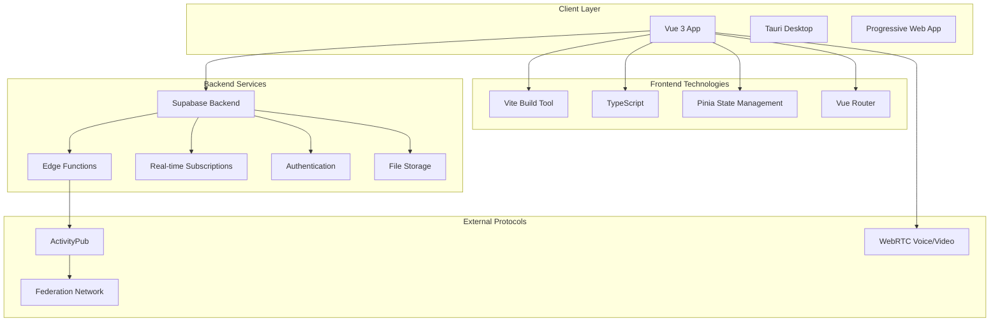
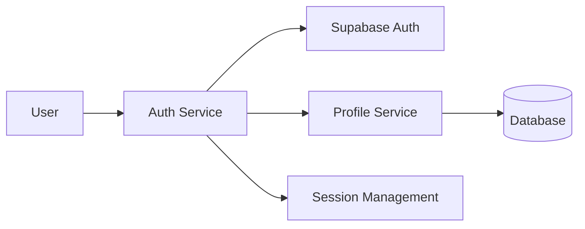
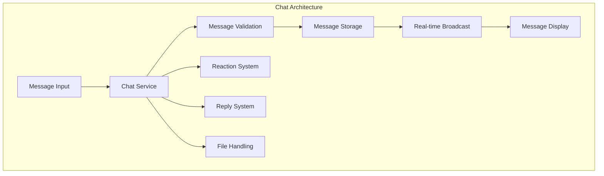
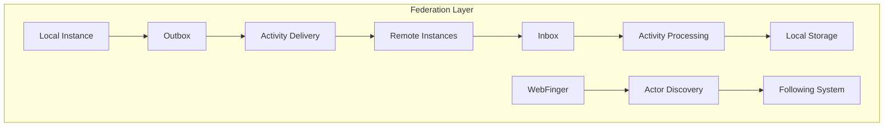
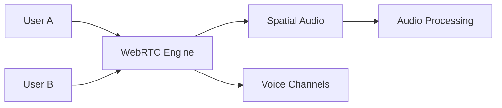
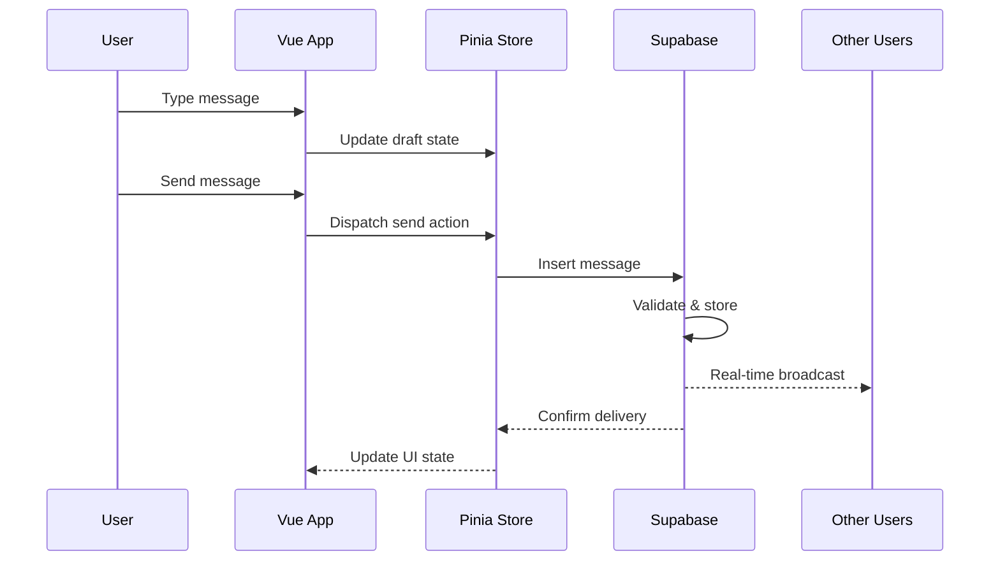
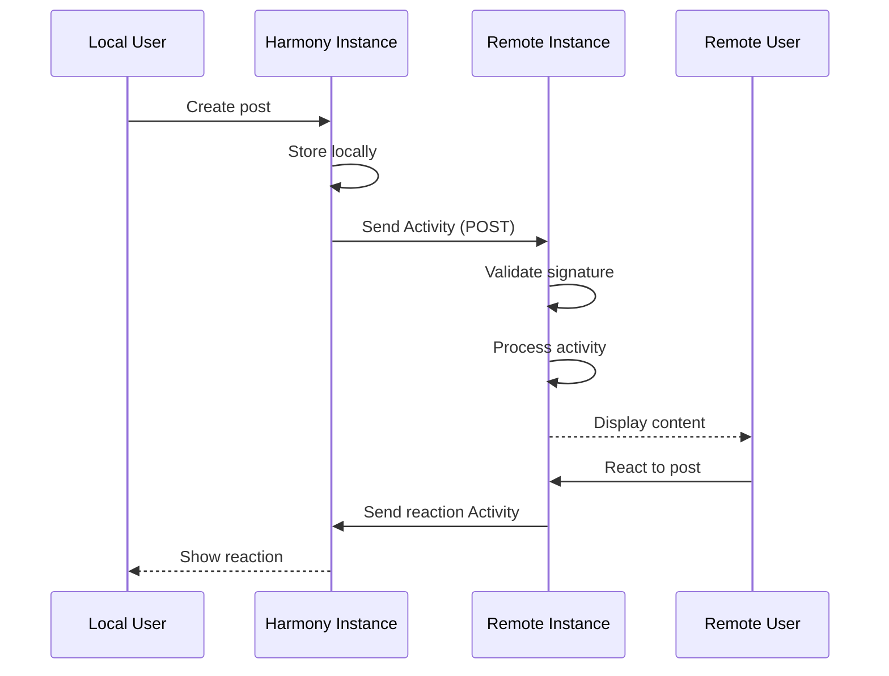
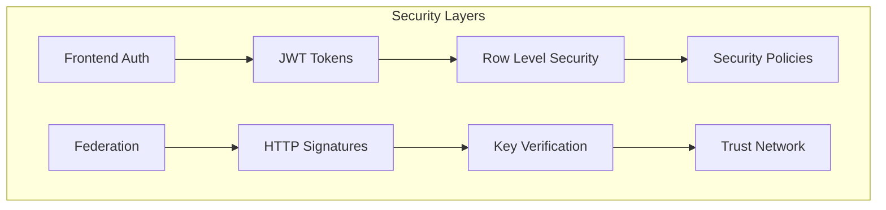
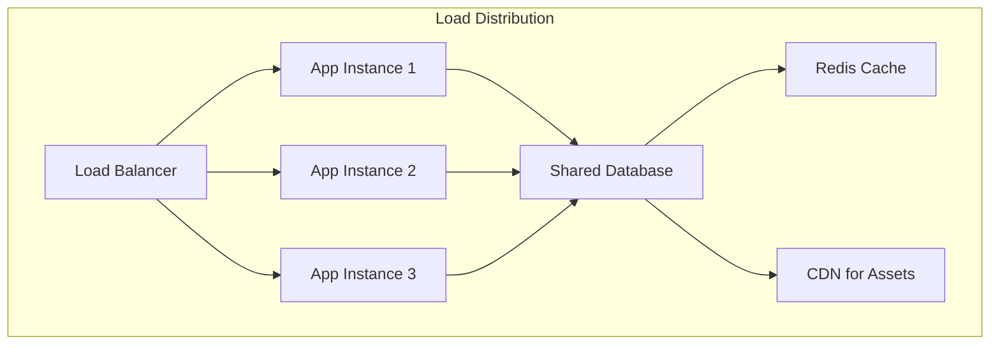
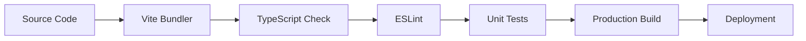

# System Architecture

Harmony is built on a modern, scalable architecture that combines the best of federated social networking with real-time chat capabilities.

## High-Level Architecture



## Technology Stack

### Frontend
- **Vue 3** - Progressive JavaScript framework with Composition API
- **TypeScript** - Type-safe JavaScript development
- **Vite** - Fast build tool and development server
- **Pinia** - State management for Vue.js
- **Vue Router** - Client-side routing
- **Tauri** - Desktop application framework

### Backend
- **Supabase** - Backend-as-a-Service platform
- **PostgreSQL** - Primary database
- **Edge Functions** - Serverless API endpoints
- **Real-time Engine** - WebSocket-based real-time updates
- **Row Level Security** - Database-level authorization

### Protocols & Standards
- **ActivityPub** - W3C standard for federated social networking
- **WebRTC** - Real-time communication for voice/video
- **WebSockets** - Real-time bidirectional communication

## Core Modules

### 1. Authentication & User Management



**Key Components:**
- JWT-based authentication
- OAuth providers (GitHub, Google, etc.)
- Profile management
- Session persistence
- Role-based access control

### 2. Real-time Chat System



**Features:**
- Real-time message delivery
- Rich text formatting
- File attachments
- Message reactions
- Reply threading
- Message history

### 3. ActivityPub Federation



**Capabilities:**
- Cross-instance communication
- User discovery via WebFinger
- Activity delivery and processing
- Content synchronization
- Privacy controls

### 4. Voice & Video Communication



**Technologies:**
- MediaSoup for scalable media
- Spatial audio positioning
- Voice activity detection
- Noise suppression
- Screen sharing

## Data Flow Architecture

### Message Flow



### Federation Flow



## Security Architecture

### Authentication Flow



**Security Measures:**
- JWT token authentication
- Row-level security in database
- HTTP signature verification for federation
- CORS protection
- Rate limiting
- Input validation and sanitization

## Scalability Considerations

### Horizontal Scaling



**Scaling Strategies:**
- Stateless application design
- Database connection pooling
- CDN for static assets
- Caching for frequently accessed data
- Microservice architecture preparation

## Development Architecture

### Code Organization

```
src/
├── components/          # Vue components
│   ├── chat/           # Chat-specific components
│   ├── activitypub/    # Federation components
│   └── shared/         # Reusable components
├── stores/             # Pinia state stores
├── services/           # Business logic services
├── composables/        # Vue composition functions
├── types/              # TypeScript type definitions
└── utils/              # Utility functions
```

### Build Pipeline



This architecture ensures Harmony is:
- **Scalable** - Can handle growing user bases
- **Maintainable** - Clear separation of concerns
- **Secure** - Multiple layers of protection
- **Federated** - Interoperable with other instances
- **Real-time** - Instant communication capabilities
- **Modern** - Uses current best practices and technologies
