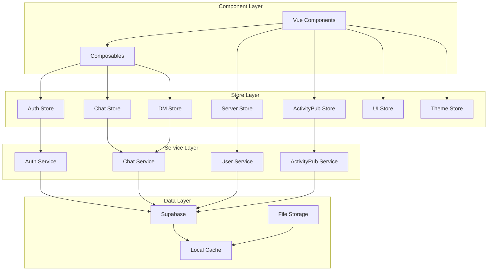
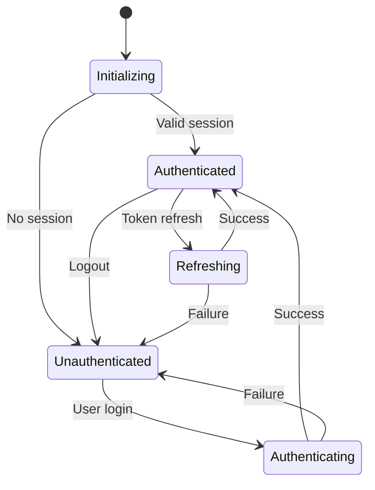
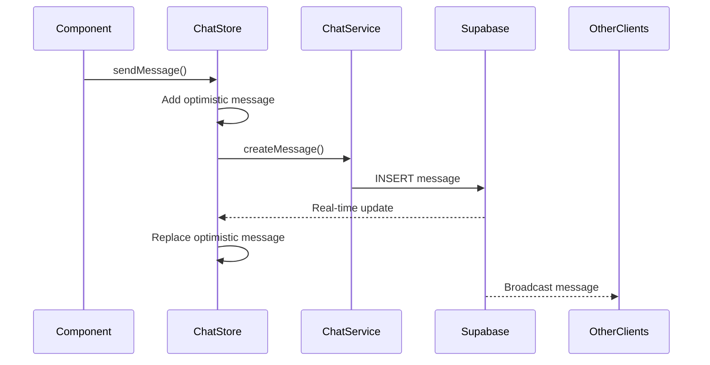

# State Management

Harmony uses Pinia for reactive state management, providing a centralized store architecture with TypeScript integration.

## Store Architecture Overview



## Core Stores

### Auth Store

**Purpose**: Manages user authentication and session state

```typescript
interface AuthState {
  user: User | null
  session: Session | null
  isLoading: boolean
  isAuthenticated: boolean
}

interface AuthActions {
  login(credentials: LoginCredentials): Promise<void>
  logout(): Promise<void>
  refreshSession(): Promise<void>
  updateProfile(updates: ProfileUpdates): Promise<void>
}
```

**State Flow**:


### Chat Store

**Purpose**: Manages chat messages, channels, and real-time updates

```typescript
interface ChatState {
  messages: Record<string, Message[]>
  currentChannelId: string | null
  isLoading: boolean
  hasMore: boolean
  typingUsers: Record<string, User[]>
}

interface ChatActions {
  sendMessage(message: CreateMessagePayload): Promise<void>
  loadMessages(channelId: string): Promise<void>
  loadMoreMessages(): Promise<void>
  subscribeToChannel(channelId: string): void
  unsubscribeFromChannel(channelId: string): void
}
```

**Message Flow**:


### Server Store

**Purpose**: Manages servers, channels, and memberships

```typescript
interface ServerState {
  servers: Server[]
  currentServerId: string | null
  channels: Record<string, Channel[]>
  members: Record<string, ServerMember[]>
  permissions: Record<string, Permission[]>
}

interface ServerActions {
  fetchServers(): Promise<void>
  joinServer(inviteCode: string): Promise<void>
  createServer(serverData: CreateServerPayload): Promise<void>
  createChannel(channelData: CreateChannelPayload): Promise<void>
  updatePermissions(updates: PermissionUpdates): Promise<void>
}
```

## Store Patterns

### Reactive State Updates

```typescript
// Store with reactive getters
export const useChatStore = defineStore('chat', () => {
  // State
  const messages = ref<Record<string, Message[]>>({})
  const currentChannelId = ref<string | null>(null)
  
  // Getters (computed)
  const currentMessages = computed(() => {
    return currentChannelId.value 
      ? messages.value[currentChannelId.value] || []
      : []
  })
  
  const unreadCount = computed(() => {
    return Object.values(messages.value)
      .flat()
      .filter(msg => !msg.isRead).length
  })
  
  // Actions
  const sendMessage = async (payload: CreateMessagePayload) => {
    // Optimistic update
    const optimisticMessage = createOptimisticMessage(payload)
    addMessageToChannel(payload.channelId, optimisticMessage)
    
    try {
      // API call
      const savedMessage = await chatService.createMessage(payload)
      // Replace optimistic with real message
      replaceMessage(optimisticMessage.id, savedMessage)
    } catch (error) {
      // Remove optimistic message on failure
      removeMessage(optimisticMessage.id)
      throw error
    }
  }
  
  return {
    // State
    messages: readonly(messages),
    currentChannelId: readonly(currentChannelId),
    // Getters
    currentMessages,
    unreadCount,
    // Actions
    sendMessage
  }
})
```

### Real-time Subscriptions

```typescript
export const useChatStore = defineStore('chat', () => {
  const subscriptions = new Map<string, RealtimeChannel>()
  
  const subscribeToChannel = (channelId: string) => {
    if (subscriptions.has(channelId)) return
    
    const subscription = supabase
      .channel(`messages:${channelId}`)
      .on('postgres_changes', {
        event: 'INSERT',
        schema: 'public',
        table: 'messages',
        filter: `channel_id=eq.${channelId}`
      }, (payload) => {
        const newMessage = payload.new as Message
        addMessageToChannel(channelId, newMessage)
      })
      .on('postgres_changes', {
        event: 'UPDATE',
        schema: 'public', 
        table: 'messages',
        filter: `channel_id=eq.${channelId}`
      }, (payload) => {
        const updatedMessage = payload.new as Message
        updateMessage(updatedMessage)
      })
      .subscribe()
    
    subscriptions.set(channelId, subscription)
  }
  
  const unsubscribeFromChannel = (channelId: string) => {
    const subscription = subscriptions.get(channelId)
    if (subscription) {
      subscription.unsubscribe()
      subscriptions.delete(channelId)
    }
  }
  
  return { subscribeToChannel, unsubscribeFromChannel }
})
```

### Cross-Store Communication

```typescript
// Auth store notifies other stores of user changes
export const useAuthStore = defineStore('auth', () => {
  const user = ref<User | null>(null)
  
  const logout = async () => {
    await authService.logout()
    user.value = null
    
    // Notify other stores to clear user-specific data
    const chatStore = useChatStore()
    const dmStore = useDMStore()
    const activityStore = useActivityPubStore()
    
    chatStore.clearUserData()
    dmStore.clearUserData()
    activityStore.clearUserData()
  }
  
  return { user, logout }
})

// Other stores listen for auth changes
export const useChatStore = defineStore('chat', () => {
  const authStore = useAuthStore()
  
  // Watch for auth changes
  watch(() => authStore.user, (newUser, oldUser) => {
    if (!newUser && oldUser) {
      // User logged out, clear chat data
      clearAllData()
    } else if (newUser && !oldUser) {
      // User logged in, initialize chat
      initializeForUser(newUser)
    }
  })
  
  return { /* store implementation */ }
})
```

## State Persistence

### Local Storage Integration

```typescript
export const useThemeStore = defineStore('theme', () => {
  // Load from localStorage on initialization
  const theme = ref<Theme>(
    (localStorage.getItem('harmony-theme') as Theme) || 'system'
  )
  
  const setTheme = (newTheme: Theme) => {
    theme.value = newTheme
    localStorage.setItem('harmony-theme', newTheme)
    applyTheme(newTheme)
  }
  
  // Auto-save to localStorage
  watch(theme, (newTheme) => {
    localStorage.setItem('harmony-theme', newTheme)
  })
  
  return { theme, setTheme }
})
```

### Session Storage for Temporary State

```typescript
export const useLayoutStore = defineStore('layout', () => {
  const sidebarCollapsed = ref<boolean>(
    sessionStorage.getItem('sidebar-collapsed') === 'true'
  )
  
  const toggleSidebar = () => {
    sidebarCollapsed.value = !sidebarCollapsed.value
    sessionStorage.setItem('sidebar-collapsed', String(sidebarCollapsed.value))
  }
  
  return { sidebarCollapsed, toggleSidebar }
})
```

## Performance Optimization

### Lazy Loading Stores

```typescript
// Only load store when needed
const loadChatStore = () => {
  return import('@/stores/useChat').then(module => module.useChatStore())
}

// In component
const initializeChat = async () => {
  const chatStore = await loadChatStore()
  chatStore.initializeForChannel(channelId)
}
```

### Selective State Updates

```typescript
export const useChatStore = defineStore('chat', () => {
  const messages = ref(new Map<string, Message>())
  
  // Only update specific message fields
  const updateMessageField = <K extends keyof Message>(
    messageId: string,
    field: K,
    value: Message[K]
  ) => {
    const message = messages.value.get(messageId)
    if (message) {
      message[field] = value
      // Trigger reactivity for this specific message
      messages.value.set(messageId, { ...message })
    }
  }
  
  return { updateMessageField }
})
```

### Memory Management

```typescript
export const useChatStore = defineStore('chat', () => {
  const MAX_MESSAGES_PER_CHANNEL = 500
  
  const addMessage = (channelId: string, message: Message) => {
    const channelMessages = messages.value[channelId] || []
    
    // Add new message
    channelMessages.push(message)
    
    // Trim old messages if over limit
    if (channelMessages.length > MAX_MESSAGES_PER_CHANNEL) {
      channelMessages.splice(0, channelMessages.length - MAX_MESSAGES_PER_CHANNEL)
    }
    
    messages.value[channelId] = channelMessages
  }
  
  return { addMessage }
})
```

## Store Testing

### Unit Testing Stores

```typescript
describe('ChatStore', () => {
  beforeEach(() => {
    setActivePinia(createPinia())
  })

  test('sends message and updates state', async () => {
    const chatStore = useChatStore()
    
    // Mock the service
    vi.mocked(chatService.createMessage).mockResolvedValue({
      id: 'msg-1',
      content: 'Hello',
      authorId: 'user-1'
    })
    
    await chatStore.sendMessage({
      content: 'Hello',
      channelId: 'channel-1',
      authorId: 'user-1'
    })
    
    expect(chatStore.currentMessages).toContainEqual(
      expect.objectContaining({ content: 'Hello' })
    )
  })

  test('handles optimistic updates correctly', async () => {
    const chatStore = useChatStore()
    
    // Start with optimistic message
    const messagePromise = chatStore.sendMessage({
      content: 'Hello',
      channelId: 'channel-1',
      authorId: 'user-1'
    })
    
    // Should immediately show optimistic message
    expect(chatStore.currentMessages).toHaveLength(1)
    expect(chatStore.currentMessages[0].isOptimistic).toBe(true)
    
    await messagePromise
    
    // Should replace with real message
    expect(chatStore.currentMessages).toHaveLength(1)
    expect(chatStore.currentMessages[0].isOptimistic).toBe(false)
  })
})
```

### Integration Testing

```typescript
describe('Store Integration', () => {
  test('auth logout clears all user data', async () => {
    const authStore = useAuthStore()
    const chatStore = useChatStore()
    
    // Setup user data
    authStore.setUser(mockUser)
    chatStore.addMessage('channel-1', mockMessage)
    
    // Logout
    await authStore.logout()
    
    // Verify cleanup
    expect(authStore.user).toBeNull()
    expect(chatStore.messages).toEqual({})
  })
})
```

This state management architecture provides:
- **Reactive Updates**: Automatic UI updates when state changes
- **Type Safety**: Full TypeScript integration
- **Real-time Sync**: WebSocket-based real-time updates
- **Performance**: Optimized for large datasets
- **Testability**: Easy to unit and integration test
- **Persistence**: Configurable state persistence
